# Google IdP to Keycloak OIDC brokering: the as-built flow

> **Audience:** architects, operators, and auditors who need to trace one
> Google login end to end through Keycloak to a scoped JWT bound to the
> audit trail, without reverse-engineering the provisioning scripts.
> **Anchors:** [ADR-042](../ADR-042-oidc-authorization-code-pkce.md) (OIDC
> Authorization Code + PKCE, BFF-first), [ADR-044](../ADR-044-external-idp-federation.md)
> (external IdP federation via Keycloak brokering),
> [`idp-federation-setup.md`](../guides/idp-federation-setup.md) (operator
> runbook), [`oauth2-device-flow-user-guide.md`](../guides/oauth2-device-flow-user-guide.md)
> (the separate CLI/headless login path).

## BLUF

AuditTrace-AI never authenticates a user directly. Keycloak brokers the
login to Google, mints its own JWT once Google confirms the user's
identity, and every downstream system (the memory-server, Postgres, the
trace store) trusts only that Keycloak-signed JWT. The federated
identity's whole reason for existing is the last hop: the JWT's `sub`
claim becomes `user_id`, stamped once at the API boundary, and flows into
every audit row, log line, and trace for that request. A federated login
that never reaches that last hop is a login without an audit trail, which
defeats the point of the product.

The realm ships with brokering disabled by default (`identityProviders: []`
in `keycloak/realm-audittrace.json`) and gains a Google broker through an
operator-run script, not through the committed realm alone. This doc
traces that whole path: the OIDC mechanics, where the live config
actually lives, the drift guard that keeps the two in sync, and the
scopes a federated user carries once logged in.

## The base realm ships with no IdP: read this before grepping the realm

`keycloak/realm-audittrace.json` declares `"identityProviders": []` and
`"identityProviderMappers": []`. A reader who greps the realm for `google`
and finds nothing would reasonably conclude federation is off. It is not:
the base realm is the no-federation baseline that every fresh install
starts from, and the Google broker is layered onto the *live* Keycloak by
`scripts/setup-idp-federation.sh` after install, per
[ADR-044 §7](../ADR-044-external-idp-federation.md#7-provisioning-workflow).
The "[Where the config lives](#where-the-config-lives)" section below
names the full toolchain that keeps the live broker and the committed
realm JSON reconciled.

## End-to-end sequence

Each hop below is labeled with the OAuth2/OIDC construct that RFC 9700
(the current OAuth 2.0 security BCP) and OIDC Core require: Authorization
Code grant only (`response_type=code`, never the deprecated implicit
grant) and PKCE with `S256` (never plain). RFC 9700 and
[ADR-042 §3](../ADR-042-oidc-authorization-code-pkce.md#3-redirect-uri-discipline)
also require **exact-match** redirect URIs, no wildcards. The live
`audittrace-webui` client does not meet that bar today (see
"[What is not here](#what-is-not-here)" for the honest gap), so the
diagram below labels `redirect_uri` as "pre-registered" rather than
claiming exact-match compliance that is not there. Two independent PKCE
exchanges happen in this flow: the client application's own exchange
with Keycloak, and Keycloak's own exchange with Google (Keycloak is a
PKCE *client* to Google, not just a PKCE *server* to the application).

```mermaid
sequenceDiagram
    participant User as Human User
    participant Browser as Browser
    participant App as Client App (OIDC RP)\nBFF pattern, ADR-042\nlive verification: webui/ public-client harness\nproduction target: LibreChat, M3
    participant KC as Keycloak\n(audittrace realm, broker)
    participant Google as Google Identity Platform\n(OIDC IdP)
    participant API as memory-server\n(/v1/chat/completions)
    participant DB as Postgres interactions\n+ trace/log (Langfuse, Tempo)

    Note over App: RFC 7636 PKCE: code_verifier = random 43-128 chars\ncode_challenge = BASE64URL(SHA256(code_verifier)), method=S256

    User->>Browser: open the app / click "Sign in with Google"
    Browser->>App: GET /login
    App->>App: build state, nonce, code_challenge (S256)\nRFC 9700: response_type=code only, never response_type=token
    App-->>Browser: 302 to Keycloak /authorize\nresponse_type=code, client_id=audittrace-webui,\nredirect_uri=(pre-registered, NOT exact-match live, see What is not here),\nscope=openid ..., code_challenge, code_challenge_method=S256,\nstate, kc_idp_hint=<google-alias>
    Browser->>KC: GET /realms/audittrace/protocol/openid-connect/auth\n?...&kc_idp_hint=<google-alias>

    Note over KC: kc_idp_hint skips the IdP chooser,\nroutes straight to the Google broker (ADR-044 par1)

    KC->>KC: build its OWN PKCE challenge, S256\n(Keycloak is a PKCE client TO Google, ADR-044 par3: pkceEnabled=true)
    KC-->>Browser: 302 to Google /authorize\nclient_id=<keycloak-as-google-oauth-client>, state, nonce,\ncode_challenge, code_challenge_method=S256,\nredirect_uri=.../realms/audittrace/broker/<alias>/endpoint

    Browser->>Google: GET /o/oauth2/v2/auth\nAuthorization Code + PKCE, response_type=code
    Google->>User: Google login + consent (MFA if enforced upstream)
    User->>Google: authenticates
    Google-->>Browser: 302 to Keycloak broker callback\n?code=<Google authz code>&state=...

    Browser->>KC: GET /realms/audittrace/broker/<alias>/endpoint\n?code=<Google authz code>&state=...
    KC->>Google: POST /token\ngrant_type=authorization_code, code=<Google authz code>,\nclient_secret=(Vault-resolved), code_verifier=(Keycloak's own)
    Google-->>KC: {id_token, access_token}\nsigned RS256, Google's own JWKS

    Note over KC: validateSignature=true, useJwksUrl=true:\nverify id_token against Google's live JWKS.\nstoreToken=false: Google's tokens are never retained.

    KC->>KC: apply identityProviderMappers (ADR-044 par4):\nusername = preferred_username or email\nemail = email, firstName/lastName = given_name/family_name

    alt first login for this Google identity
        KC->>KC: JIT-provision a shadow user in the audittrace realm\n(federation key derived from Google's sub + the IdP alias)
    else returning user
        KC->>KC: syncMode=FORCE: re-sync attributes from Google
    end

    KC->>KC: mint a Keycloak-signed JWT\niss=audittrace realm issuer, sub=realm shadow-user UUID,\naud=audittrace-server, scope=<audittrace-webui's default scopes>
    KC-->>Browser: 302 to App redirect_uri?code=<realm authz code>&state=...
    Browser->>App: GET /callback?code=...&state=...

    App->>KC: POST /realms/audittrace/protocol/openid-connect/token\ngrant_type=authorization_code, code=<realm authz code>,\ncode_verifier=(App's own), redirect_uri=(pre-registered, not exact-match live)
    KC-->>App: {access_token, id_token, refresh_token}\nsigned by the REALM key, not Google's

    Note over App: BFF pattern (ADR-042): tokens stay server-side.\nThe browser holds only an HttpOnly, Secure, SameSite=Strict\nsession cookie, never the JWT itself.

    App->>API: POST /v1/chat/completions\nAuthorization: Bearer <realm-signed JWT>

    API->>API: require_user (auth.py) token-validation checklist:\n1. alg allowlist, reject none and HSxxx\n2. verify RS256 signature against the realm JWKS\n3. iss in {realm issuer} union keycloak_issuer_extras (ADR-032 par2)\n4. aud == audittrace-server\n5. exp / nbf / clock skew\n6. scope sufficient for the request

    API->>API: user_id = claims.sub\n(token-derived, stamped at the choke point,\nnever taken from a caller-supplied header)

    API->>DB: INSERT interactions (user_id=sub, session_id, ...)\nemit trace/log carrying user_id + session_id + trace_id

    API-->>App: 200 OK + chat completion
    App-->>Browser: rendered response
```

Two RFC-correctness notes worth stating explicitly, since they are easy to
get wrong in a brokered setup:

- **The brokered JWT's issuer is Keycloak's, never Google's.** The
  memory-server validates `iss` against the audittrace realm (via the
  existing multi-issuer path from
  [ADR-032 §2](../ADR-032-oauth2-device-flow.md)), and never talks to
  Google directly. Google's identity assertion is consumed and translated
  by Keycloak; it never crosses the broker boundary as a bearer credential.
- **Two separate PKCE exchanges, two separate `code_verifier`s.** The
  application's PKCE pair (with Keycloak) and Keycloak's PKCE pair (with
  Google) are independent. Conflating them, or assuming one covers the
  other, is a common brokering mistake; the sequence above keeps them on
  separate swim lanes for exactly that reason.

## Where the config lives

The base realm's `identityProviders: []` is the honest starting point, not
the whole story. The Google broker's live configuration and lifecycle run
through a small toolchain, in this order:

1. **`scripts/setup-idp-federation.sh`** (operator-run) applies the broker
   to the *live* Keycloak. It authenticates `kcadm.sh` against the running
   instance, fetches Google's discovery document
   (`https://accounts.google.com/.well-known/openid-configuration`) to
   populate the five required endpoints, creates or updates the
   `identity-provider/instances` entry with `pkceEnabled=true`,
   `pkceMethod=S256`, `validateSignature=true`, and `syncMode=FORCE`, then
   adds the standard attribute mappers from
   [ADR-044 §4](../ADR-044-external-idp-federation.md#4-attribute-mapping-contract).
   The Google client secret is sourced from Vault at
   `kv/audittrace/idp/<alias>/client_secret` (per
   [ADR-043 §5](../ADR-043-vault-as-sole-secret-store.md)'s
   `kv/audittrace/<service>/<key>` convention), or from an `IDP_CLIENT_SECRET`
   env var as a dev-only fallback. The operator runbook is
   [`docs/guides/idp-federation-setup.md`](../guides/idp-federation-setup.md).
2. **`scripts/export-idp-federation.sh`** + **`scripts/deploy/idp_export.py`**
   capture the live broker back into version control (SPEC #403), closing
   the one-way gap noted in ADR-044 §Risks: a fresh `kc.sh start
   --import-realm` reads the realm JSON on **first boot only**, so a cold
   reimport after a realm wipe would otherwise silently drop every
   brokered IdP with no error anywhere in the deploy path.
   `idp_export.py`'s `externalize_idp_secrets()` replaces every
   `config.clientSecret` with the placeholder documented in ADR-044 §3
   (`${vault:idp/<alias>/client_secret}`), and
   `assert_no_plaintext_client_secret()` re-checks the result before it is
   ever written to a file `git add` could reach. The committed export
   location is **both** realm JSON files:
   `keycloak/realm-audittrace.json` and
   `charts/audittrace/files/realm-audittrace.json` (the second is
   patched via a text-span replace rather than a JSON round-trip, because
   it interleaves Helm template directives that a JSON parser would
   reject).
3. **`scripts/idp-drift-check.sh`** (`idp_drift_report`, a pure
   set-comparison with no cluster dependency) and **`post-deploy-verify.sh`
   Check 12** compare the declared aliases (read from the deployed realm
   ConfigMap, `<release>-keycloak-realm`, which is sourced from
   `charts/audittrace/files/realm-audittrace.json` at deploy time) against
   the live realm's `identity-provider/instances` aliases. The check FAILs
   on either an **UNDECLARED** alias (live but not committed) or a
   **MISSING** alias (committed but not live), and is unit-tested against
   fixture data by `tests/test_idp_drift_guard.py` and
   `tests/test_deploy_idp_export.py`, independent of a live cluster.

The upshot: `keycloak/realm-audittrace.json`'s empty `identityProviders`
array is correct for a fresh install and is not the source of truth for
any *running* deployment with Google brokering enabled. The drift guard is
what keeps "what is committed" and "what is live" from silently diverging
again after the initial setup.

**What is not yet automated.** Nothing in the chart today resolves the
`${vault:idp/<alias>/client_secret}` placeholder back into a real secret
before Keycloak's `--import-realm` runs (tracked in ADR-044's Follow-ups).
A cold reimport from the committed realm JSON alone would import the
placeholder string as the literal client secret, not a working broker.
Re-running `scripts/setup-idp-federation.sh` after a wipe remains the
supported recovery path until that deploy-time resolution step lands.

## Scopes

A Google-federated login carries whatever scopes the browser's OIDC
*client* (not Google) defaults to. Google's own OAuth scope
(`defaultScope: "openid email profile"`, set in the broker config) shapes
only what Google discloses to Keycloak about the user's identity; it has
no bearing on the authorization scopes the realm JWT carries downstream.
Today, every federated user of a given client gets that client's full
default scope set uniformly: for `audittrace-webui` (the client the
`webui/` verification harness and the eventual browser UI authenticate
as), that is `audittrace:query`, `audittrace:context`, `audittrace:audit`,
and all four `memory:*:read` scopes. Per-Google-group scope allocation
(so, for example, only an audit team's Google group gets
`audittrace:audit`) is named as future work in
[ADR-044's Follow-ups](../ADR-044-external-idp-federation.md#follow-ups)
and is not implemented.

Those scopes gate two layers, both driven by the same JWT `scope` claim:

- **The route itself.** `audittrace:query` is what `require_user` checks
  gets the request into `/v1/chat/completions` at all; the full scope
  table lives in
  [`sequence-oauth2-flow.md`](sequence-oauth2-flow.md#scope-vocabulary).
- **Per-tool authorization inside the chat loop.** Every entry in
  `MEMORY_TOOL_REGISTRY` (`src/audittrace/tools/__init__.py`) declares a
  `required_scope`; `tools_visible_to()` filters which memory tools a
  non-admin caller even sees, per call, from the JWT's `scope` claim, not
  from a separate roles table. A Google-federated `audittrace-webui` user
  sees `recall_decisions` (`memory:episodic:read`), `recall_skills`
  (`memory:procedural:read`), `recall_recent_sessions`
  (`memory:conversational:read-own`), and `recall_semantic`
  (`memory:semantic:read`), because those four scopes are already in the
  client's default set.

This tool-level scope check is the shape
[ADR-063](../ADR-063-mcp-entry-interface.md) generalizes for a future MCP
entry-interface: "per-tool OAuth2/OIDC scopes, resource-and-action-level"
authorization, evaluated on every call rather than once at login. A
brokered identity would authorize an individual MCP tool invocation the
same way it authorizes a memory tool inside the chat loop today; no new
identity model is required, only a wider set of scoped call sites.

## What is not here

- **SAML.** Keycloak's broker engine supports SAML through the same
  mechanism, but the realm-JSON shape differs and is documented in the
  operator runbook rather than reproduced here
  ([ADR-044 §2](../ADR-044-external-idp-federation.md#2-three-idp-protocol-types-supported)).
  `idp_export.py`'s `_SECRET_CONFIG_KEYS` allowlist (SPEC #403) covers
  only the OIDC `clientSecret` field; a SAML provider's secret-bearing
  fields (signing certificate, private key) are not externalized by
  today's export tooling. A SAML broker's config would need that
  allowlist extended before it could be captured safely.
- **Microsoft Entra ID.** Structurally supported (the realm's
  `identityProviders` array and the `oid`-to-federation-key collapse
  mapper from ADR-044 §4 both exist), but Entra is not in the live
  evidence matrix; it is deferred to a follow-up backlog item per
  [ADR-044 §8](../ADR-044-external-idp-federation.md#8-test-matrix).
- **The production BFF.** ADR-042 mandates a confidential, server-side
  BFF client (`publicClient=false`) for any browser UI. The client
  actually shipped in `keycloak/realm-audittrace.json` today,
  `audittrace-webui`, is a **public** PKCE client
  (`publicClient: true`), used by the `webui/` verification harness
  described in this doc's sequence diagram, because the production
  BFF (LibreChat) has not shipped yet (M3 Day-1). This is a known,
  tracked gap between the target architecture and what is live, not an
  oversight: the harness exists specifically to validate the broker
  wiring before the BFF lands.
- **Exact-match redirect URIs — remediated 2026-08-27 (M3-WU-1).** [ADR-042 §3](../ADR-042-oidc-authorization-code-pkce.md#3-redirect-uri-discipline)
  requires exact-match, HTTPS-only redirect URIs with no wildcards, and
  RFC 9700 names wildcard redirect URIs as a deprecated pattern behind
  multiple public-client breaches. The `audittrace-webui` client's
  committed `redirectUris` previously carried two `/*` wildcards
  (`https://audittrace.local/*`, `https://audittrace.local:30952/*`)
  alongside their exact-match `/oauth2/callback` siblings and a
  plain-HTTP `http://localhost:8765/*` entry — real drift against
  ADR-042 §3 (backlog `OIDC-REDIRECT-URI-DRIFT`). The fix (M3-WU-1):
  drop both wildcards (nothing is served through the mesh at those
  paths yet — no route consumes them; a future consumer registers its
  own exact path, same as `audittrace-librechat` does below), and
  tighten the local-dev harness's own origin from a wildcard to the
  one path it actually serves (`http://localhost:8765/`, per
  `webui/README.md` and `webui/serve.py`). That dev-only entry now
  lives in a separate `keycloak.webui.devRedirectUris` chart value
  (concatenated into the rendered client at template time) rather than
  mixed into the same list as the mesh-served exact-match entries —
  a distinct, clearly-marked dev profile, droppable per-deployment.
  `audittrace-librechat` (the M3 LibreChat console's browser client,
  also introduced in M3-WU-1) follows the same discipline from day
  one: exact-match `redirectUris`/`webOrigins` plus a
  `devRedirectUris`/`devWebOrigins` pair for LibreChat's own default
  dev port. This doc's sequence diagram's "pre-registered" label for
  `redirect_uri` now also reads as "exact-match" — the drift it
  flagged is closed.
- **Device Flow.** Human CLI/headless login (`scripts/audittrace-login`,
  ADR-032, RFC 8628) is a separate, non-browser grant that does not
  involve Google brokering at all. See
  [`oauth2-device-flow-user-guide.md`](../guides/oauth2-device-flow-user-guide.md).
