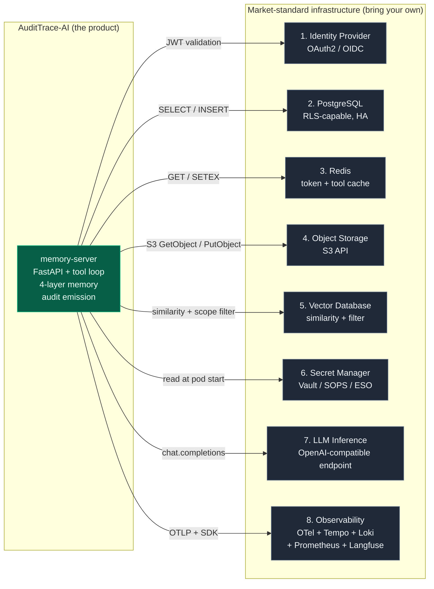

# Product boundary and dependencies

**This document answers a single question: what, precisely, is AuditTrace-AI a product of, and what does it depend on?**

It is written because the temptation in LLM tooling is to let the product boundary drift outward until the project is claiming to be a platform, an IdP, a database, a secret manager, and an observability stack — at which point no enterprise architect believes any of the claims. The architecture below draws the boundary explicitly and holds to it.

## The product

**AuditTrace-AI is one process, one container image, one Helm chart.** It is a FastAPI-based memory-server that:

- exposes a drop-in OpenAI-compatible `/v1/chat/completions` endpoint plus the `/interactions`, `/sessions`, `/memory`, `/health`, `/metrics` auxiliary endpoints;
- owns the four-layer memory architecture (episodic / procedural / conversational / semantic) exposed to the LLM via the *memory-as-tools* pattern;
- enforces per-user identity propagation, Row-Level-Security gating, and end-to-end audit-trail emission;
- ships as a single versioned container image plus an authoritative Helm chart that declares every dependency interface and default;
- is accompanied by forty-odd numbered Architecture Decision Records that document every commitment the codebase makes.

**That is the entire product surface.** Everything else on the deployment diagram is a dependency — a component we consume, not a component we build.

## The dependencies — at a glance

The product is the green box. The grey boxes are the enterprise's responsibility. We do not resell them, we do not claim to improve them, and we do not attempt to rebuild them. We consume them through well-defined interfaces that the ADRs specify.

## The eight dependencies — in detail

For each dependency we state the *role* (what we need it for), the *interface* (the concrete contract), the *default* (what the current chart ships for a dev install), the *production alternatives* (what the enterprise is free to substitute), the *minimum security posture* (what must be true for the enterprise deployment to be defensible), and the *current gap* (what is not yet implemented in this direction).

### 1. Identity Provider (OAuth2 / OIDC)

| Aspect | Detail |
|---|---|
| **Role** | Authenticate human agents (OAuth2 Device Flow, RFC 8628) and service clients (`client_credentials`). Issue JWTs that carry the user's `sub`, scopes, and `aud`. |
| **Interface** | OIDC-compliant issuer + JWKS endpoint + Device Flow endpoints. Standard since ~2019. |
| **Default (dev)** | Keycloak bundled in the Helm umbrella (hand-templated, not a Bitnami subchart). |
| **Production alternatives** | Any OIDC-compliant IdP: Keycloak self-hosted, Okta, Microsoft Entra ID, Google Workspace, Ping Identity, Auth0. The enterprise's existing IdP federated via Keycloak brokering (preferred pattern — keeps AuditTrace-AI out of the employee-account lifecycle). |
| **Minimum security posture** | RS256 or ES256 signing, JWKS rotation with published cache TTL, `aud` claim validation enforced, `exp` claim enforced. |
| **Current gap** | Self-hosted Keycloak only. No brokering to enterprise IdPs yet. *Addressed by ADR-044 (M2 milestone), target 2026-05-02.* |

### 2. PostgreSQL (RLS-capable, HA)

| Aspect | Detail |
|---|---|
| **Role** | Persistent store for the audit trail (`interactions`, `sessions`, `tool_calls`). Row-Level-Security enforcement point. Conversational-memory layer (Layer 3). |
| **Interface** | PostgreSQL 14+ (15+ recommended for FORCE RLS + RLS-bypassing role attributes). psycopg2 / SQLAlchemy. |
| **Default (dev)** | Bitnami PostgreSQL 16 single-node. |
| **Production alternatives** | AWS RDS PostgreSQL, Azure Database for PostgreSQL, Google Cloud SQL, CrunchyData Postgres Operator, Patroni-managed PostgreSQL cluster. Any managed or self-hosted HA setup that supports RLS and non-superuser roles. |
| **Minimum security posture** | Non-superuser application role (`audittrace_app` — NOSUPERUSER, NOBYPASSRLS). `FORCE ROW LEVEL SECURITY` on audit tables. TLS in transit. Separate role for the background summariser (`audittrace_summariser` — BYPASSRLS with minimum-privilege grants). |
| **Current gap** | Single-writer, no read replicas. *Addressed by roadmap Phase 1.3, target 2026-05-16.* |

### 3. Redis

| Aspect | Detail |
|---|---|
| **Role** | Hot-path JWT token cache (`TokenCache`, 5-minute TTL) and memory-as-tools result cache (`ToolResultCache`, 15-minute TTL). |
| **Interface** | Redis 7+, standard Redis protocol, optional TLS. |
| **Default (dev)** | Bitnami Redis single-node. |
| **Production alternatives** | AWS ElastiCache, Azure Cache for Redis, Google Memorystore, Bitnami Redis Sentinel / Cluster, self-hosted KeyDB or Dragonfly. |
| **Minimum security posture** | Authentication required (`requirepass`). TLS in transit. Key prefix namespacing (`audittrace:token:*`, `audittrace:tool-result:*`) so a shared Redis is safe. |
| **Current gap** | Single-node only in the chart. HA swap is Bitnami configuration flag, trivial. |

### 4. Object Storage (S3 API)

| Aspect | Detail |
|---|---|
| **Role** | Episodic and procedural memory layers (ADR files, skill documents) plus any artefact storage. Stateless memory-server (ADR-027) — no pod filesystem state. |
| **Interface** | S3 API (both path-style and virtual-hosted), SSE-S3 encryption at rest, multi-part upload for objects > 5 MB. |
| **Default (dev)** | MinIO single-node deployed via custom chart template. |
| **Production alternatives** | AWS S3, Azure Blob Storage (via S3-compatible gateway), Google Cloud Storage (via S3-compatible gateway), MinIO distributed mode, Swift, Ceph RadosGW, on-prem enterprise object stores. |
| **Minimum security posture** | SSE-S3 or SSE-KMS encryption at rest. IAM-equivalent per-key scope. TLS in transit. Separate buckets for shared (`memory-shared`) vs per-user (`memory-private`) content. |
| **Current gap** | None blocking. S3-compatibility is generic; swapping MinIO for AWS S3 is a Helm values change. |

### 5. Vector Database (similarity + filter)

| Aspect | Detail |
|---|---|
| **Role** | Semantic-memory layer (Layer 4). Similarity search with per-user filter for tenant isolation. |
| **Interface** | Embedding dimensionality 768 (nomic-embed-text v1.5) or configurable. Cosine similarity with metadata filter. |
| **Default (dev)** | ChromaDB single-node with token authentication. |
| **Production alternatives** | Weaviate, Qdrant, Milvus, pgvector (merges into the PostgreSQL dependency — one fewer component), pgvecto.rs, Pinecone (cloud-hosted — breaks sovereignty claim for regulated customers). |
| **Minimum security posture** | Per-user scope enforced at the service layer (`UserScopedSemanticService` wrapper). Token authentication. TLS in transit. |
| **Current gap** | Single-database. Architecturally swappable via the `SemanticService` port (ADR-018) but no alternative ports are implemented. Adding pgvector would merge this dependency into the PostgreSQL one — attractive for enterprises that already run HA Postgres. |

### 6. Secret Manager

| Aspect | Detail |
|---|---|
| **Role** | Provide database passwords, JWKS-rotation keys, MinIO KMS key, Langfuse credentials, and any future integration secrets to the memory-server pod without secrets appearing in Helm values or container environments. |
| **Interface** | Either (a) at-pod-start injection (Vault Agent Injector, External Secrets Operator, Secrets Store CSI Driver), or (b) at-deploy substitution (SOPS, Sealed Secrets). |
| **Default (dev)** | Plain Kubernetes Secrets with values passed via Helm values. Explicitly dev-only. |
| **Production alternatives** | HashiCorp Vault with Agent Injector sidecar, External Secrets Operator with AWS Secrets Manager / Azure Key Vault / GCP Secret Manager back-end, Mozilla SOPS with age or GPG, Sealed Secrets controller, Bitnami Secrets Manager integration. |
| **Minimum security posture** | Secrets never logged, never in Helm values in production, rotatable without container rebuild, audit trail on secret access (the vault's responsibility, not ours). |
| **Current gap** | Vault integration shipping in M1 per ADR-043 (Proposed 2026-04-25): in-cluster sub-chart + KV v2 + Kubernetes auth + Vault Agent Injector pattern. Workload migrations land alongside. |

### 7. LLM Inference Endpoint

| Aspect | Detail |
|---|---|
| **Role** | Language-model inference for chat completions, embeddings generation, and session summarisation. Three distinct model endpoints today. |
| **Interface** | OpenAI-compatible `/v1/chat/completions` and `/v1/embeddings` (or equivalent) — the same contract the memory-server exposes outward, consumed inward from upstream. |
| **Default (dev)** | Three llama-server (llama.cpp) instances on the host, OS-managed systemd services: Qwen 3.6-27B-Q4_K_M for chat (swapped from 35B-A3B 2026-04-24 — the Q8_0 variant fails to load on gfx1151), nomic-embed-text v1.5 for embeddings, Mistral 7B Instruct v0.3 for session summarisation. |
| **Production alternatives** | vLLM for high-throughput serving, NVIDIA Triton Inference Server, TGI (Text Generation Inference), Ollama, or any OpenAI-compatible cloud provider *if the sovereignty constraint permits external inference* (it usually does not for regulated customers). |
| **Minimum security posture** | No internet egress for the sovereignty story. TLS in transit. Token-authenticated inbound (when the inference stack supports it — llama.cpp does not by default; vLLM does). |
| **Current gap** | Hardware-profile validation matrix is limited to AMD Ryzen AI MAX+ on Linux. Apple Silicon and NVIDIA laptop profiles claimed as hardware-agnostic but empirically unproven. *Addressed by roadmap Phase 1.4, target 2026-05-16.* |

### 8. Observability Stack

| Aspect | Detail |
|---|---|
| **Role** | Regulatory-grade audit substrate. Langfuse renders the LLM view (traces, generations, tool calls). Tempo stores the full OpenTelemetry span tree across every outbound edge. Loki collects structured logs per pod/namespace. Prometheus scrapes metrics. Grafana provides the operator view. |
| **Interface** | OpenTelemetry OTLP (HTTP/gRPC) for traces and metrics. Langfuse SDK for LLM-specific observations. Promtail / Loki push protocol for logs. |
| **Default (dev)** | Sibling observability-stack repository (Docker Compose) — Langfuse 3.x + Tempo 2.6 + Prometheus + Loki + Grafana + OpenTelemetry Collector. AuditTrace-AI chart ships an OTel Collector DaemonSet inside the k3s cluster that fans out to the sibling stack. |
| **Production alternatives** | Self-hosted: Grafana Cloud Stack (Loki, Tempo, Mimir) with self-hosted Langfuse. Datadog, New Relic, Honeycomb (cloud-hosted — breaks sovereignty for regulated customers). Elastic Observability + Langfuse self-hosted. |
| **Minimum security posture** | Observability backend is inside the jurisdiction. Traces/logs/metrics carry `user.id` tagging (ADR-026). Retention policies documented per data category. |
| **Current gap** | Only the sibling Docker Compose deployment is documented. An operator with an existing Grafana stack would need to merge in by hand. An "integration guide per major platform" is a documentation gap, not a code gap. |

## Deployment profiles

The same Helm chart ships three deployment profiles. Each profile is a different answer to *"which of the eight dependencies do you bring, and which do we bundle?"*

### Profile A — Z-book (consultant laptop)

Everything on one device. Used by a single consultant doing client work on-device with zero outbound dependencies.

| Dependency | Source |
|---|---|
| IdP | Bundled Keycloak (subchart) |
| PostgreSQL | Bundled single-node |
| Redis | Bundled single-node |
| Object Storage | Bundled MinIO single-node |
| Vector DB | Bundled ChromaDB single-node |
| Secret Manager | Plain K8s Secrets (acceptable on a local single-user machine) |
| LLM Inference | Host-level llama.cpp services |
| Observability | Bundled sibling Docker Compose stack on same host |

### Profile B — Single-host on-premises (small team)

Everything still on one host but backed by real services. The shared small-team deployment.

| Dependency | Source |
|---|---|
| IdP | Bundled Keycloak, federated with the small team's existing Google Workspace / Microsoft 365 |
| PostgreSQL | Bundled Bitnami chart with one primary + one read replica |
| Redis | Bundled Bitnami chart with Sentinel |
| Object Storage | Bundled MinIO or enterprise S3-compatible |
| Vector DB | Bundled ChromaDB or swap to pgvector (consolidates dependency count) |
| Secret Manager | SOPS or ESO (no full Vault deployment warranted at this scale) |
| LLM Inference | Single GPU node running vLLM |
| Observability | Bundled sibling stack |

### Profile C — Enterprise (bring your own everything)

The enterprise runs Vault, Okta, HA PostgreSQL, ElastiCache Redis, AWS S3, Datadog/Grafana-Cloud, a GPU cluster running Triton. AuditTrace-AI is deployed as a stateless workload that consumes all eight via configuration.

| Dependency | Source |
|---|---|
| IdP | Enterprise Okta / Entra ID federated into a small AuditTrace Keycloak (the Keycloak is a brokering layer, not the identity source of truth) |
| PostgreSQL | Enterprise HA cluster (Patroni / RDS / Cloud SQL) |
| Redis | Enterprise ElastiCache or equivalent |
| Object Storage | Enterprise S3 or S3-compatible |
| Vector DB | Enterprise-procured (Qdrant, Weaviate, pgvector) |
| Secret Manager | Enterprise Vault |
| LLM Inference | Enterprise GPU pool with Triton or vLLM |
| Observability | Enterprise Grafana Cloud / Datadog / equivalent |

The Helm chart toggles between profiles via values overlay (`values-zbook.yaml`, `values-onprem.yaml`, `values-enterprise.yaml`). Existing chart supports A and B today; C is Phase 1 + Phase 3 of the roadmap.

## The story for enterprise architects

> AuditTrace-AI ships one thing — a memory-server that is audit-by-design for LLM deployments in regulated industries. It depends on eight components that your enterprise either already runs or can procure from the established market (IdP, Postgres, Redis, object storage, vector DB, secret manager, LLM inference, observability). We document each dependency's minimum security posture, the alternatives that work, and the interface contract. We do not resell, rebuild, or reinvent any of them. Our job stops at the memory-server's pod boundary.

This framing — not a platform, not a suite, one well-scoped component with eight well-documented dependencies — is what makes AuditTrace-AI auditable. Platforms accumulate scope until nothing in them is auditable. This is the inverse bet.

## Gap assessment — consolidated

The six gaps above, mapped to roadmap phases:

| # | Dependency | Gap | Milestone | Target |
|---|---|---|---|---|
| 1 | IdP | No enterprise federation | M2 (ADR-044) | 2026-05-02 |
| 2 | PostgreSQL | Single-writer | post-POC | TBD |
| 3 | Secret Manager | Vault integration shipping in M1 | M1 (ADR-043) | 2026-04-25 |
| 4 | LLM Inference | Hardware profile unproven beyond Ryzen AI | M4 | 2026-05-12 |
| 5 | Vector DB | No pgvector alternative port | Scoped; not time-bound | — |
| 6 | Observability | No "integration guide per major platform" | Documentation, ongoing | — |

## Non-goals

Explicit scope limits, recorded here because every review eventually asks:

- We will not build an IdP. We will federate with yours.
- We will not build a vector database. We will consume ChromaDB today, pgvector tomorrow, whatever else the port supports.
- We will not build an observability platform. We will emit OpenTelemetry and Langfuse SDK events that your stack consumes.
- We will not build a secret manager. We will read from yours.
- We will not host LLM inference. We will call your OpenAI-compatible endpoint.
- We will not manage HA for any dependency. Your ops team already does that better than a memory-server's developer can.

Each "will not" is a scope-protection decision. The breadth gained by crossing any of them is not worth the loss of audit clarity on the boundary line.

---

*See also: [`ADR-041`](../ADR-041-product-boundary-and-dependencies.md) — the formal decision record. [`roadmap.md`](../roadmap.md) — the dated delivery plan for gap closure. [`reconstructibility-walkthrough.md`](../reconstructibility-walkthrough.md) — the end-to-end audit demonstrator.*
