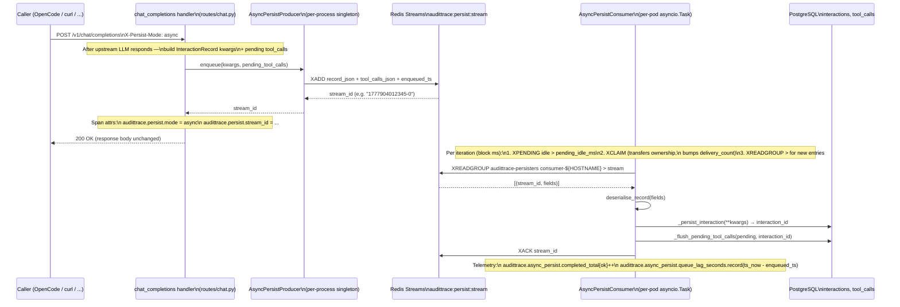
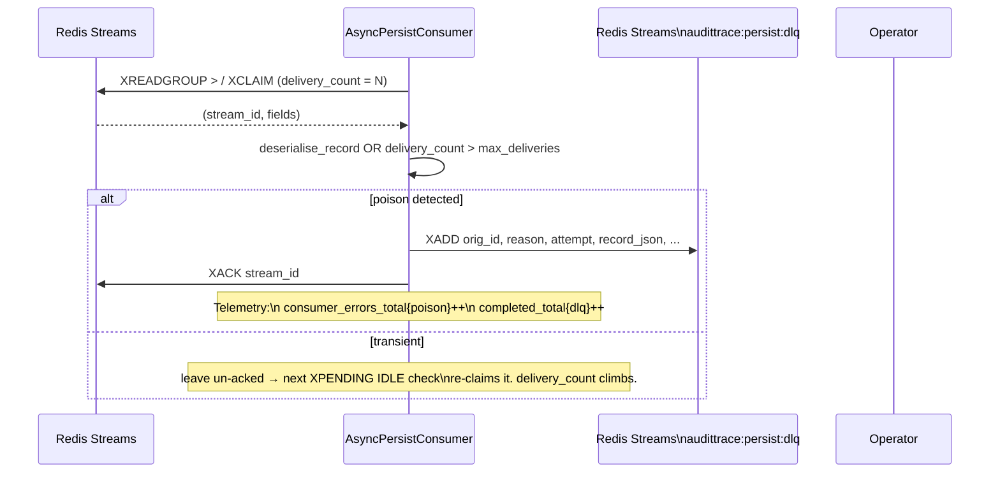
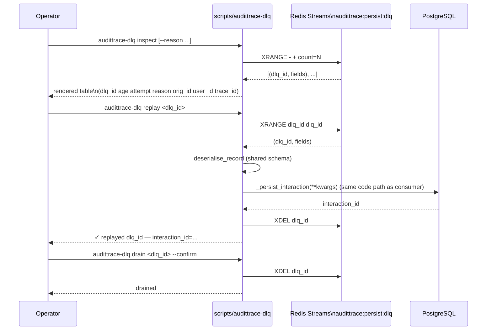

# Async chat-completion persistence (ADR-046)

This sequence covers the opt-in `X-Persist-Mode: async` flow that moves
`_persist_interaction` off the chat-completion synchronous path. The
default path stays synchronous and is bit-identical to the pre-ADR-046
behaviour (per `feedback_openai_schema_inviolate`).

Three viewpoints below: producer happy path, poison → DLQ, and the
operator-driven replay flow.

## Happy path (producer → consumer)

## Poison message (consumer → DLQ)

A poison message is one that consistently fails to land — JSON parse
failure, RLS reject, invalid schema, or `delivery_count >
max_deliveries`. Rather than bouncing forever, the consumer XADDs the
entry to the DLQ stream and XACKs the original.

## Operator replay (`scripts/audittrace-dlq`)

The DLQ is operator-drained — no auto-retry. The CLI runs from the
operator's machine via `kubectl port-forward` against Redis +
Postgres; same auth path as `make verify-deploy`. No HTTP admin
endpoint added (defers OpenAPI surface to the follow-up PR).

## Why Redis Streams (vs `asyncio.create_task`)

Three structural advantages relevant to the multi-pod target:

1. **Multi-pod safety by construction.** Redis consumer-group routing
   delivers each entry to exactly one consumer in the
   `audittrace-persisters` group. Two memory-server pods racing on the
   same `XADD` is impossible. Trigger #1 of the original ADR-046 §8
   defer list.

2. **Cross-pod survival on hard kill.** Un-acked messages stay in
   Redis. `XPENDING` IDLE check on any consumer's next iteration
   re-claims them. `kubectl delete pod` mid-flight loses no
   `interactions` rows. Trigger #3 of the original §8 defer list.

3. **First-class DLQ.** The poison handling above is straightforward to
   build because the DLQ is just another stream. Operator triage is
   `XRANGE` / `XDEL` / `XADD-to-main` — modeled as the
   `scripts/audittrace-dlq` CLI.

See ADR-046 §3, §4, §6, §8 for the full design lock; ADR-046 Live
evidence section for the multi-pod proof captured during the
implementation PR's verification step.
