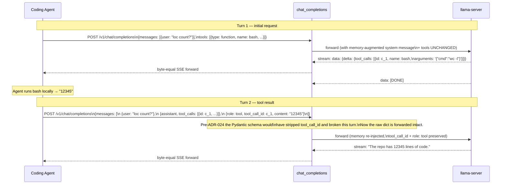
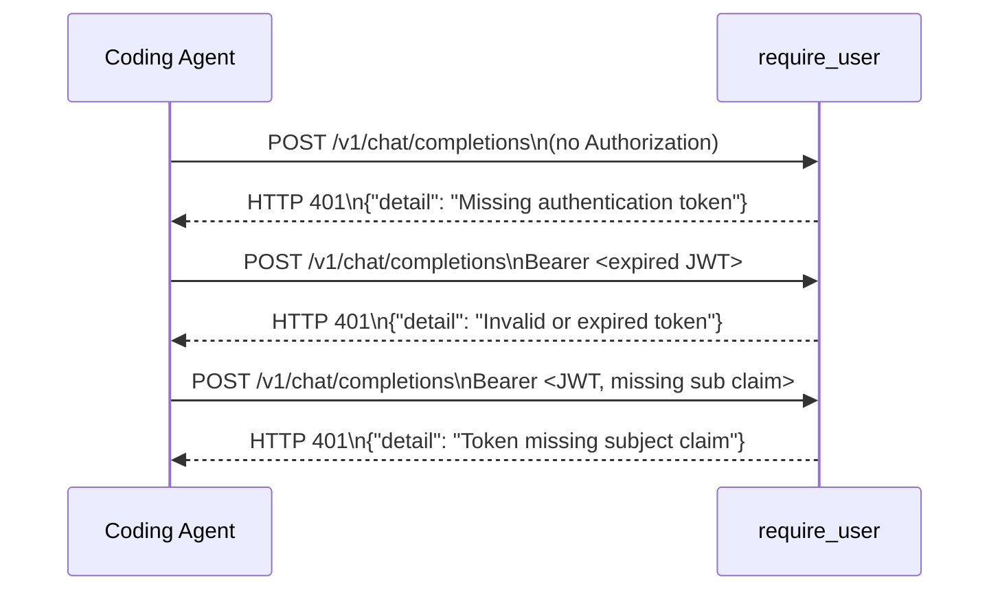
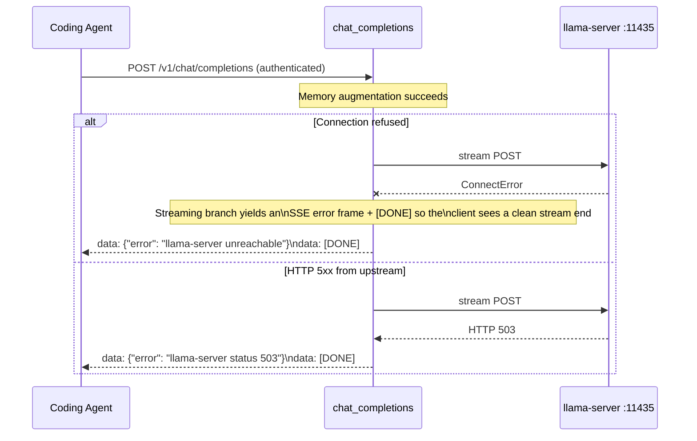

# Sequence Diagram: /v1/chat/completions

> **Updated 2026-05-01** — added the **OpenCode TLS proxy hop** (Caddy
> reverse proxy on 127.0.0.1:11434). OpenCode 1.14.x is a Bun-compiled
> single-file binary, and Bun 1.3.x's native `fetch()` does not honour
> NODE_EXTRA_CA_CERTS / SSL_CERT_FILE / OS trust store, so it cannot
> verify our self-signed `audittrace.local` cert. Rather than disable
> verification globally (`NODE_TLS_REJECT_UNAUTHORIZED=0`) we run a
> loopback proxy that listens plain HTTP and forwards over verified
> TLS to Istio Gateway. JWT auth is unchanged — the loopback hop is
> not authenticated by TLS but every request still carries the bearer
> JWT and audittrace verifies it. Other clients (curl, Continue, Roo
> Code) continue to use the direct TLS path. The `llama_chunk_timeout`
> default also bumped from 120s → 600s to accommodate first-chunk
> latency on 27B Q4 + consumer GPU when prompt eval exceeds the
> previous bound (ADR-034 idle-timeout knob, see `config.py`).
>
> **Updated 2026-04-11** for ADR-024 (raw-dict pass-through, async streaming,
> tool-call accumulation, Langfuse trace decoupling) and DESIGN §15
> (Keycloak-delegated identity via `require_user`). The handler is no
> longer a synchronous validate-and-forward pipeline — it is an async
> streaming pass-through with explicit trace_id capture.
>
> **Mode branch (ADR-025):** the handler reads
> `settings.memory_mode` per request. The flow below documents the
> default **`inject`** path — the 4-layer context built up front and
> merged into the system message. The alternative **`tools`** path —
> ambient context + proxy-internal memory tool-call loop — is covered
> in its own document: [`sequence-memory-tool-call.md`](sequence-memory-tool-call.md).
> Tools-mode is now the shipped default as of v0.3.0.
>
> **Hybrid recall (ADR-030 Part 1):** the `recall_recent_sessions`
> arrow into `PostgresConversationalService.load_sessions` now merges
> REAL `SessionRecord` rows with SYNTHETIC rows built from the first
> question + last answer of `interactions.session_id` values that have
> no matching summary yet. Synthetic rows carry `synthetic: True` and
> the memory-handler prefixes the snippet with `[draft — not yet
> summarised]` so the LLM treats them as lower-confidence hints. The
> background worker that populates real summaries (and so transparently
> drains the synthetic pool) is documented in
> [`sequence-summariser-cycle.md`](sequence-summariser-cycle.md).

The chat completions endpoint (inject mode):

1. Validates the bearer JWT and resolves a typed `UserContext` via
   `require_user` (DESIGN §15) — sub-millisecond on the Redis cache hot
   path, ~1-2ms on the cold path.
2. Builds the 4-layer memory context inside an `@observe`-decorated
   helper that returns a `trace_id` value (post-ADR-024 — span lifetime
   is decoupled from the streaming generator).
3. Augments the system message with the memory context, preserving
   every other field on every other message (raw dict pass-through —
   no Pydantic stripping of `tools`, `tool_calls`, `tool_call_id`).
4. Forwards the augmented payload to llama-server with
   `httpx.AsyncClient.stream()`.
5. Streams the SSE response back to the client byte-equal, accumulating
   `delta.tool_calls` chunks for the audit trail.
6. After the stream ends, persists the interaction and updates the
   Langfuse trace via the ingestion API with the captured `trace_id`.

## Streaming chat — happy path

```mermaid
sequenceDiagram
    participant Agent as Coding Agent
    participant Caddy as audittrace-opencode-proxy<br/>(Caddy on 127.0.0.1:11434,<br/>OpenCode-only path)
    participant Gateway as Istio Gateway (TLS)
    participant Auth as require_user
    participant Cache as TokenCache (Redis)
    participant Chat as chat_completions\n(routes/chat.py)
    participant Build as _build_memory_context_with_trace\n(@observe — captures trace_id)
    participant Builder as ContextBuilderService
    participant LLM as llama-server :11435
    participant DB as PostgreSQL
    participant LF as Langfuse\n(ingestion API)

    alt OpenCode (Bun fetch — cannot verify self-signed cert)
        Agent->>Caddy: POST /v1/chat/completions\nAuthorization: Bearer <JWT>\nbaseURL=http://127.0.0.1:11434/v1
        Note over Caddy: Cert pinned to ~/.config/audittrace/ca.crt;<br/>Host header rewritten to audittrace.local;<br/>flush_interval=-1 for SSE streaming
        Caddy->>Gateway: Forward over verified TLS\n(SNI=audittrace.local, JWT preserved)
    else Other clients (curl, Continue, Roo Code)
        Agent->>Gateway: POST /v1/chat/completions\nAuthorization: Bearer <JWT>\n{messages, model, tools, tool_choice, stream: true}
    end
    Gateway->>Auth: TLS terminated → HTTP (mTLS via Envoy sidecar)

    Auth->>Cache: get(sha256(token))
    Cache-->>Auth: UserContext (hot path)
    Auth-->>Chat: UserContext

    Note over Chat: payload = await http_request.json()\n(raw dict — never Pydantic-parsed,\ntools/tool_calls survive intact)

    Chat->>Build: asyncio.to_thread(...)

    rect rgb(220, 230, 250)
        Note over Build,Builder: Inside @observe span — trace_id captured here
        Build->>Builder: build_system_context_with_stats(project, query)

        par 4-layer retrieval
            Builder->>Builder: episodic.search(query)
        and
            Builder->>Builder: procedural.search(query)
        and
            Builder->>Builder: conversational.as_context(project)
        and
            Builder->>Builder: semantic.search(query, k=4)
        end

        Builder-->>Build: memory_context string
        Build->>Build: _set_genai_request_attributes(...)\n(input.value, gen_ai.*, langfuse.session.id)
        Build-->>Chat: (memory_context, trace_id)
    end

    Note over Chat: augmented_messages = _merge_system_message(\n  payload['messages'], memory_context\n)\nproxy_payload = dict(payload)\nproxy_payload['messages'] = augmented_messages

    Chat->>LLM: async with httpx.AsyncClient().stream(\n  "POST", llama_url, json=proxy_payload\n) as resp

    loop For each SSE line from llama-server
        LLM-->>Chat: data: {choices: [{delta: {content/tool_calls/...}}]}
        Chat->>Chat: accumulate text content + tool_calls (by index)
        Chat-->>Gateway: yield (line + "\n").encode()
        Gateway-->>Agent: byte-equal SSE chunk
    end

    LLM-->>Chat: data: [DONE]
    Note over Chat: Inject synthetic OpenAI usage chunk\n(from llama.cpp timings field)
    Chat-->>Agent: data: {usage: {...}}
    Chat-->>Agent: data: [DONE]

    Note over Chat: Stream finished — post-stream work begins

    Chat->>Chat: answer = "".join(text_chunks)\n+ render [tool_call] lines if accumulated

    alt X-Persist-Mode: async + async_persist_enabled (ADR-046)
        Chat->>Redis: XADD audittrace:persist:stream\n{record_json, tool_calls_json, ...}
        Note over Chat: Returns response immediately;\nconsumer XACKs out-of-band.
    else default (sync)
        Chat->>DB: INSERT interactions\n(user_id = UserContext.user_id\n= Keycloak sub)
    end

    Chat->>LF: POST /api/public/ingestion\n{id: trace_id, output: answer,\nmetadata: {...}, sessionId: ...}

    Note over LF: Trace updated WITHOUT relying on\nthe @observe span context manager\n(it has already exited — see ADR-024)
```

## Tool call round-trip

When the model returns `tool_calls` in the stream, OpenCode runs the
tool locally and sends the result back as a follow-up `role: tool`
message. The proxy preserves these fields verbatim — the entire
purpose of the raw-dict pass-through (ADR-024).



## Authentication errors



See `sequence-oauth2-flow.md` for the full identity resolution flow
including the Redis cache hot/cold paths.

## LLM proxy errors



## What changed since the previous version of this doc

- **2026-05-01 — OpenCode TLS proxy hop**: new `Caddy` participant on
  the OpenCode path. Streaming SSE responses flow back along the same
  hop in reverse (Gateway → Caddy → Agent) — the proxy is fully
  transparent at the HTTP layer and only changes the TLS posture.
  Idle timeout `llama_chunk_timeout` default also bumped from 120s
  → 600s (10 min) to accommodate first-chunk delay on 27B Q4 + consumer
  GPU when OpenCode's tool-laden ~5K-token prompt exceeds the previous
  bound during prompt eval. Once Bun ships the `NODE_EXTRA_CA_CERTS`
  fix for `fetch()`, the proxy + OpenCode-baseURL change can be
  reverted in a single commit.
- **ADR-024**: raw dict pass-through, async streaming with
  `httpx.AsyncClient.stream()`, tool_calls accumulation, `@observe`
  trace_id capture, post-stream Langfuse update via ingestion API.
- **DESIGN §15**: identity is now resolved via `require_user` (NOT
  the legacy `require_scope`); the hot path is a Redis cache lookup;
  cold path validates against Keycloak JWKS.
- **`user_id` in audit rows**: now stores the Keycloak `sub` claim
  directly. No FK to a local users table because no such table exists.
- **ADR-025**: a `memory_mode` branch now sits at the top of the
  handler. When `memory_mode=tools` the request routes through
  `_handle_tools_mode` and the tool-call loop described in
  `sequence-memory-tool-call.md`. Inject-mode behaviour is unchanged.
