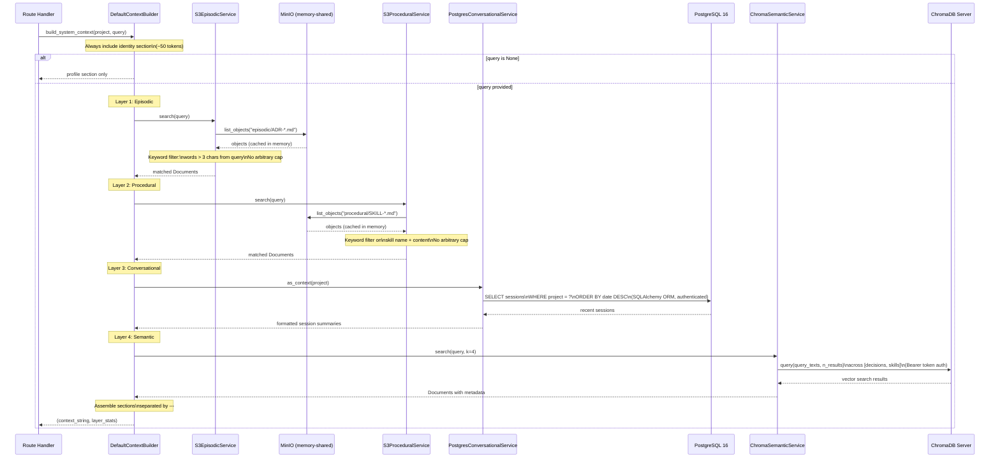
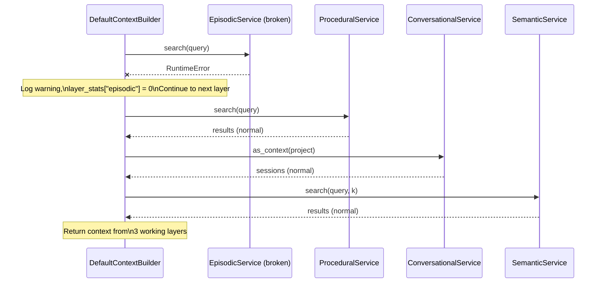
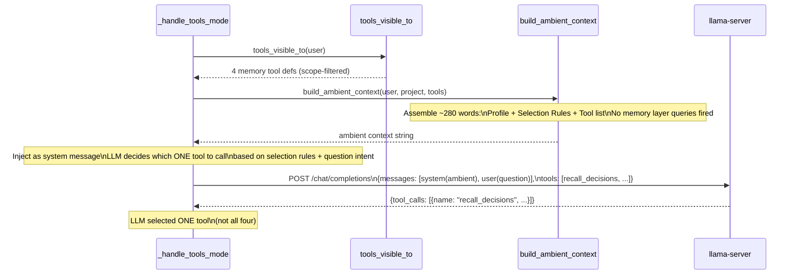

# Sequence Diagram: build_system_context()

Internal flow of the `DefaultContextBuilder.build_system_context()` method.
Each layer is wrapped in try/except — failure in one layer does not break
the others. The query drives what is retrieved — "hello" returns nothing,
"KV cache compression" returns ADR-009.

## Exception Isolation

## Tools-mode: build_ambient_context() (ADR-025, Accepted)

When `SOVEREIGN_MEMORY_MODE=tools`, the full 4-layer context build does NOT run.
Instead, `build_ambient_context()` produces a lightweight system message (~280 words)
containing:

1. **Profile** — username, role, project, date
2. **Selection rules** — intent-to-tool mapping that guides the LLM to pick ONE tool:
   - Architectural decision → `recall_decisions`
   - Methodology/pattern → `recall_skills`
   - Previous session → `recall_recent_sessions`
   - Everything else → `recall_semantic` (fallback)
3. **Tool descriptions** — name + truncated description for each visible tool

The LLM reads the selection rules and calls only the most relevant tool per question.
No proxy-side classifier is needed — the model makes its own routing decision.

