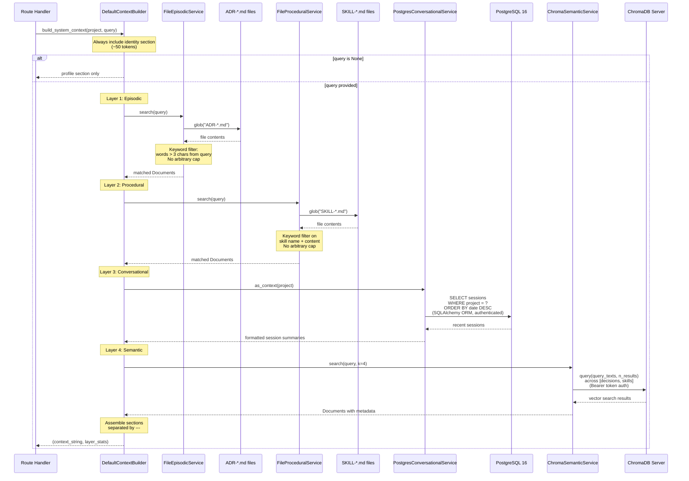
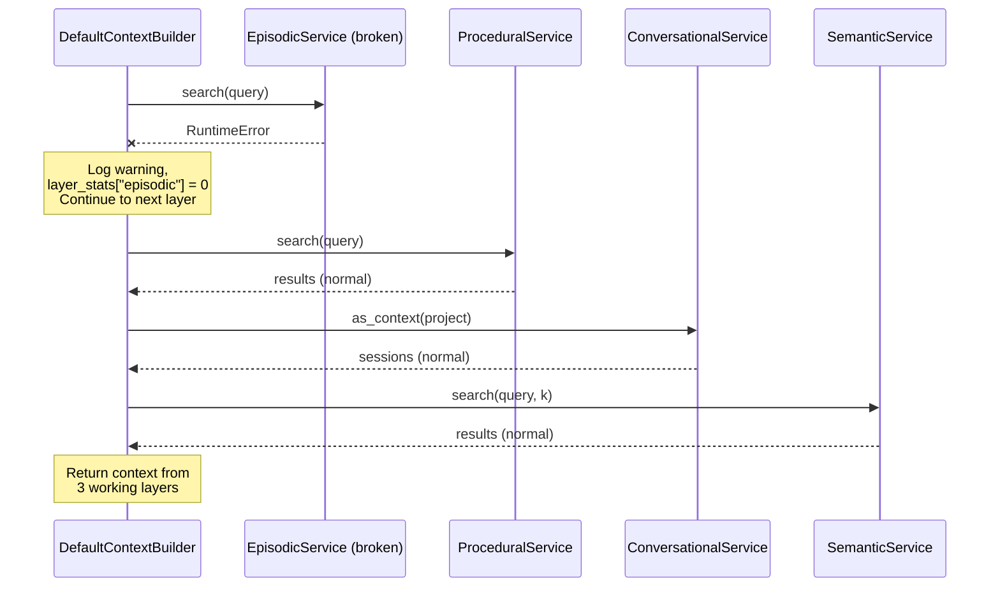

# Sequence Diagram: build_system_context()

Internal flow of the `DefaultContextBuilder.build_system_context()` method.
Each layer is wrapped in try/except — failure in one layer does not break
the others. The query drives what is retrieved — "hello" returns nothing,
"KV cache compression" returns ADR-009.

## Exception Isolation

