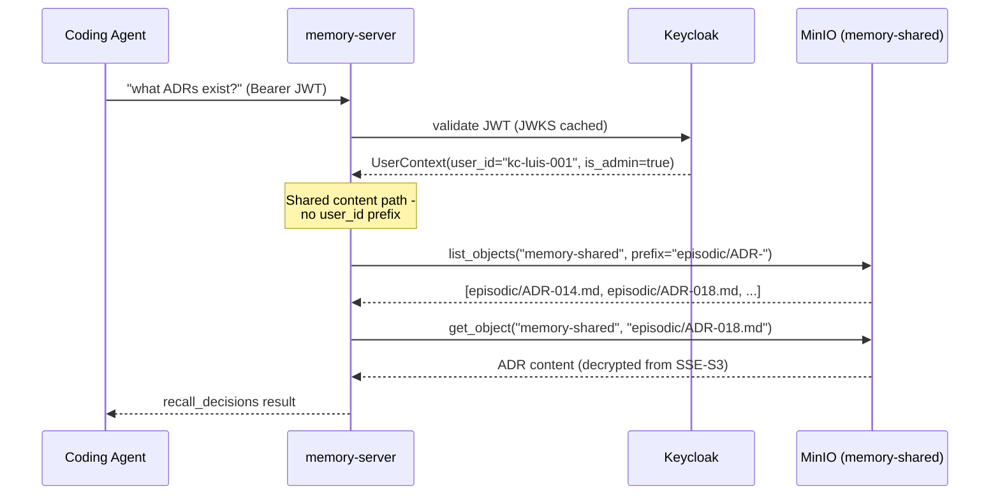
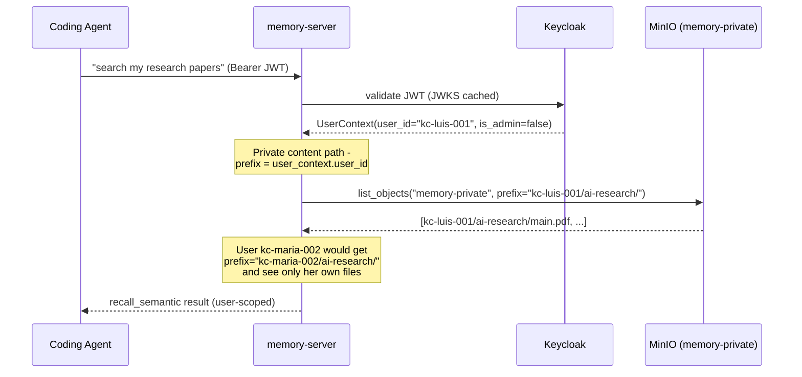
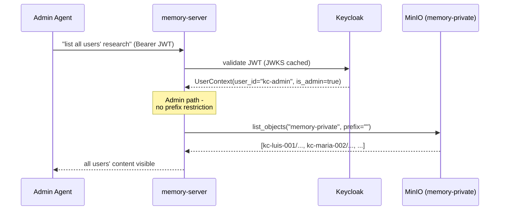

# Sequence Diagram: MinIO AuthZ — Shared vs Private Content (ADR-027)

Two distinct access paths based on content tier. The memory-server mediates
all MinIO access — end-user JWTs never reach MinIO. Per-user isolation is
enforced by path prefix derived from the validated JWT `sub` claim.

## Shared Content (memory-shared bucket)

ADRs and skills are organisation-wide — any authenticated user can read.
No user_id prefix applied.

## Private Content (memory-private bucket)

Research papers and coursework are per-user. Path prefix enforced
from JWT `sub` claim — user John cannot read Maria's objects.

## Admin Access

Admins bypass the prefix constraint — consistent with PostgreSQL RLS
admin behaviour and `UserScopedSemanticService`.

## Isolation Model Comparison

| Layer | Service | Shared | Per-user mechanism |
|-------|---------|--------|-------------------|
| PostgreSQL | RLS | N/A | `set_config('app.current_user_id', sub)` |
| ChromaDB | SemanticService | `decisions`, `skills` | `where={"user_id": ...}` |
| MinIO | S3*Service | `memory-shared` bucket | `{user_id}/` path prefix |
