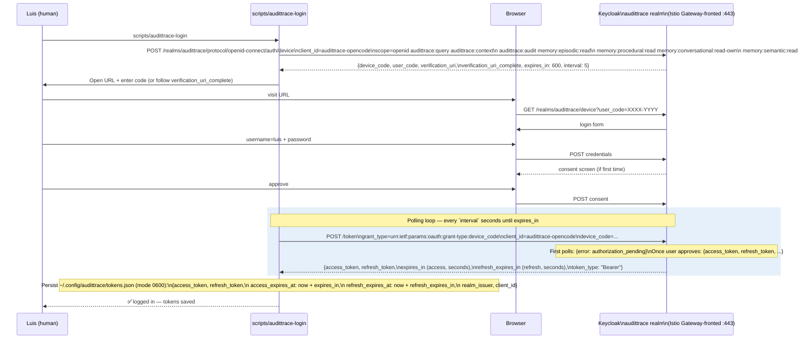
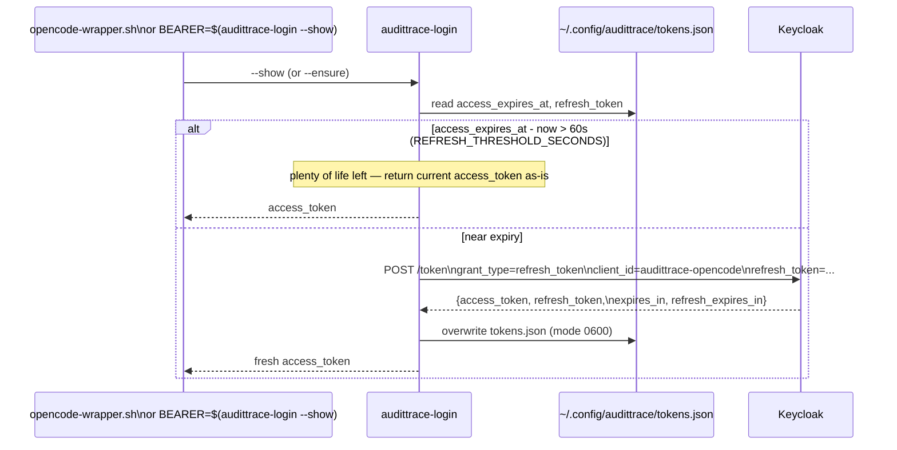
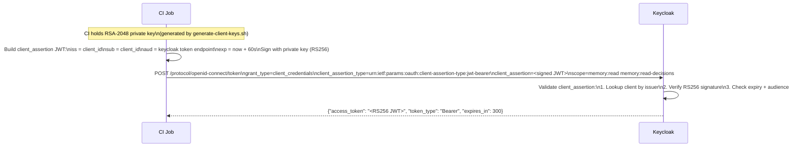
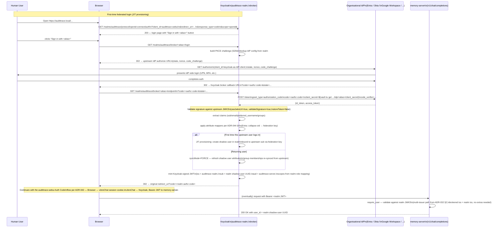
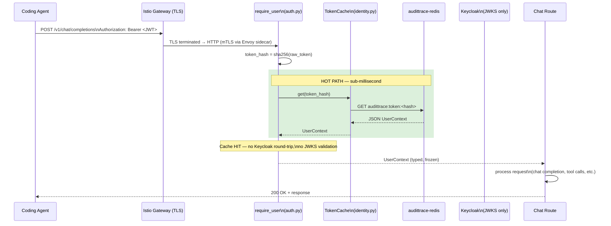
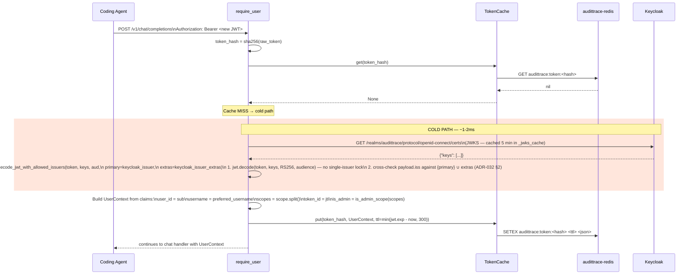
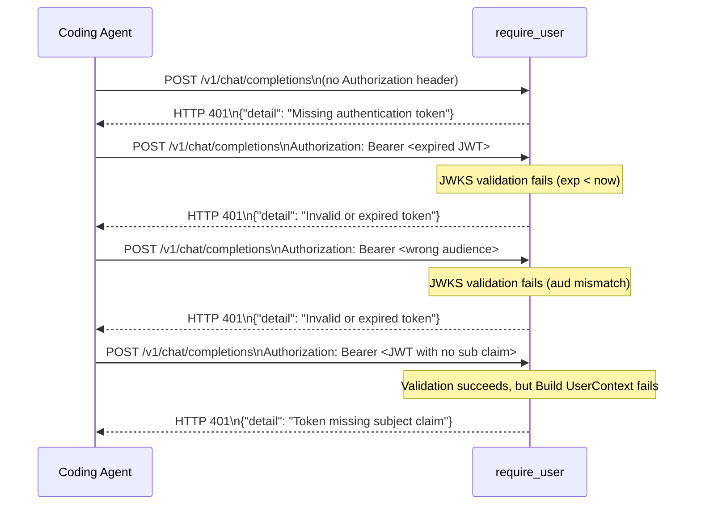
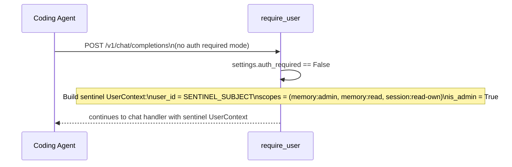

# Sequence Diagram: OAuth2 + Identity Resolution (DESIGN §15, ADR-032)

> **Updated 2026-04-15** for ADR-032 (OAuth2 Device Authorization Grant
> + multi-issuer JWT validation). Prior updates: 2026-04-11 for the §15
> refactor (Keycloak-delegated identity + Redis-backed token cache).
>
> The previous PAT model from Phase 0/1 was dropped via Alembic migration
> 004. Authentication today is two flows side-by-side: **Device Flow for
> humans** (this document's headline path) and **client_credentials for
> service accounts** (CI, smoke tests).

## The three-script surface (ADR-032)

Three CLI tools ship with the Device Flow; everything else in this
document is the protocol they implement.

| Script | Role |
|---|---|
| `scripts/audittrace-login` | User-facing login: interactive Device Flow (default), `--show` (print access_token, silent refresh), `--ensure` (refresh-if-needed, exit 0 on valid), `--logout` (delete tokens). Tokens land in `~/.config/audittrace/tokens.json` mode 0600. |
| `scripts/opencode-wrapper.sh` | Canonical OpenCode launcher. Runs `--ensure`, merges `Authorization: Bearer <token>` into every provider in `~/.config/opencode/config.json`, execs `opencode`. One-command session start. |
| `scripts/setup-human-user.sh` | Realm provisioner for already-running Keycloak instances that pre-date ADR-032. Uses the master-realm admin API to create the `audittrace-opencode` public client + `luis` realm user. Idempotent. |

## Token acquisition (OAuth2 Device Flow — for human users)

The human runs `scripts/audittrace-login` once per machine. Keycloak
returns a `user_code` + `verification_uri_complete`; the user opens
that URL in any browser, logs in, and the script's polling loop picks
up the access_token + refresh_token. Tokens persist to
`~/.config/audittrace/tokens.json` (mode 0600) with absolute expiry
timestamps so no consumer has to track "when did I fetch this".

## Token refresh (silent, inside the SSO session lifetime)

`audittrace-login --show` and `--ensure` check the saved
`access_expires_at` against now. If the access token is within
`REFRESH_THRESHOLD_SECONDS` (default 60) of expiry, the CLI silently
posts a `refresh_token` grant, overwrites `tokens.json` with the new
pair, and returns. Callers (wrappers, ad-hoc scripts) never see a
401 from expired tokens while the refresh chain still holds.

After the refresh chain itself expires (realm `ssoSessionMaxLifespan`
+ `offlineSessionIdleTimeout`, both set to 30 days in our realm JSON),
`--ensure` exits non-zero; the wrapper falls back to the interactive
login path.

## Token acquisition (OAuth2 client_credentials — for service accounts)

Headless agents (CI jobs, automation, smoke tests) use
`audittrace-dev` via `client_credentials`. Same output shape —
a Keycloak-signed JWT — but the token's `iss` claim carries the
**internal** docker-network hostname because the client authenticates
from inside the stack (see `scripts/mint-dev-jwt.sh`). **No PATs
anywhere in the system after the §15 refactor.** See ADR-032 §2 for
why both issuer values coexist.

## Federated login via brokered IdP (ADR-044) — for human users with an organisational IdP

When a deployment is configured with one or more brokered identity
providers (`scripts/setup-idp-federation.sh` per ADR-044 §7), the
human's login surface includes a "Sign in with <IdP>" button on the
Keycloak login page. The user authenticates against their own
employer's IdP; Keycloak brokers the result into a shadow user in
the `audittrace` realm and issues its own JWT — signed with the
realm key, audience-mapped to `audittrace-server`.

Critical invariant: **the memory-server never talks to the upstream
IdP.** Every JWT it validates is signed by the audittrace realm; the
multi-issuer logic from ADR-032 §2 covers brokered tokens unchanged
because the brokered JWT's `iss` is the realm's own issuer.

Two operational outcomes worth highlighting:

- **Deprovisioning is upstream-controlled.** When the customer
  removes an employee from their IdP, the next login attempt fails
  at the upstream `/authorize` step. The Keycloak shadow user
  remains in the realm but stops being usable — a customer-side
  audit can scrub stale shadows on their own cadence.
- **Group changes propagate on next login.** `syncMode=FORCE` means
  Keycloak re-fetches the upstream attributes on every brokered
  login, including group memberships. Realm-role mappings re-evaluate;
  scopes change accordingly. No long-lived stale shadow.

The next two sections describe what happens AFTER the JWT lands at
the memory-server. They apply identically whether the JWT came from
Device Flow, `client_credentials`, or a brokered login — the
audience mapper and the `iss` claim are the same.

## Identity resolution at the proxy (the §15 hot/cold path)

Every authenticated request flows through `require_user`. Hot path is a
Redis cache lookup (sub-millisecond). Cold path validates the JWT against
Keycloak's JWKS endpoint, builds a typed `UserContext`, and writes it to
the cache for subsequent requests.

### Cold path — first request with a new token

### Failure cases

### Bypass mode (development / migration window)

When `AUDITTRACE_AUTH_REQUIRED=false` (the default during the multi-user
migration window), `require_user` short-circuits the entire flow and
returns a sentinel `UserContext`. No JWKS fetch, no cache lookup, no
Keycloak round-trip. Used so existing tests and dev workflows continue
to work unchanged until Phase 5 flips the flag.

## Token revocation under the new model

Two layers of revocation, with different latencies:

1. **Keycloak-side revocation** (admin disables a user, removes a client,
   rotates a key) takes effect immediately for *new* token issuance and
   *cold path* validations. Tokens already in the Redis cache continue
   to validate until their cache TTL expires.
2. **Cache-side eviction** happens automatically on TTL (default 300s).
   Manual eviction via `TokenCache.invalidate(token_hash)` is available
   for the future logout endpoint.

**Maximum revocation latency:** the cache TTL (5 minutes by default).
This is a deliberate trade-off for performance — see DESIGN §15.6 for
the full reasoning. Tighter revocation is one config flip away
(`AUDITTRACE_TOKEN_CACHE_TTL_SECONDS=60`).

## Scope vocabulary

Scopes come from the Keycloak realm — NOT from a local roles→scopes
mapping table. The realm administrator configures which OAuth2 scopes
are granted to which clients via the Keycloak admin console (or, in
our case, via the shipped `keycloak/realm-audittrace.json` +
`scripts/setup-human-user.sh`). The `scope` claim in the JWT is
authoritative.

The audittrace realm declares these nine client-scopes (source of
truth: `keycloak/realm-audittrace.json`):

| Scope | Granted to | What it gates |
|---|---|---|
| `audittrace:query` | every authenticated client | `/v1/chat/completions`, `/session/save` |
| `audittrace:context` | humans + context-builder clients | `/context` endpoint |
| `audittrace:audit` | humans + admin-client | `/interactions` audit endpoint (ADR-029) |
| `audittrace:index` | `inject-memory` client only | write-side memory indexing |
| `audittrace:admin` | `admin-client` only | `/metrics` + admin-only ops |
| `memory:episodic:read` | humans + dev client | `recall_decisions` tool (ADR-025) — read ADRs |
| `memory:procedural:read` | humans + dev client | `recall_skills` tool — read SKILL files |
| `memory:conversational:read-own` | humans + dev client | `recall_recent_sessions` tool — read your own chat history |
| `memory:semantic:read` | humans + dev client | `recall_semantic` tool — vector search |

**Client → scope matrix** (shipped defaults):

| Client | Flow | Default scopes |
|---|---|---|
| `audittrace-opencode` (ADR-032, humans) | Device Flow | `audittrace:query`, `:context`, `:audit`, all four `memory:*` |
| `audittrace-dev` (CI / smoke) | client_credentials | identical to `audittrace-opencode` — so the dev path exercises the full scope surface |
| `opencode-agent`, `continue-agent`, `roocode-agent` | client-JWT client_credentials | `audittrace:query` only (legacy, pre-ADR-032) |
| `inject-memory` | client-JWT | `audittrace:context`, `:index` |
| `admin-client` | client-JWT | `audittrace:admin`, `:audit` |

`is_admin` in the resolved `UserContext` is derived programmatically
via `is_admin_scope()` — true when the `audittrace:admin` scope is
present. No `memory:admin` or `admin:*` scope exists in the realm;
admin capability flows through `audittrace:admin` only.
