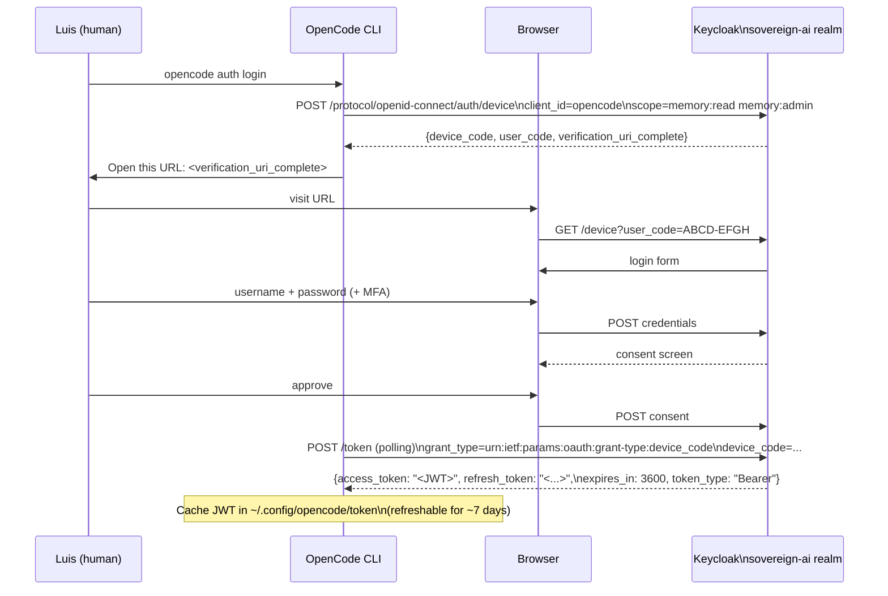
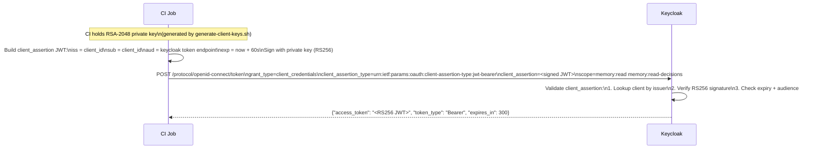
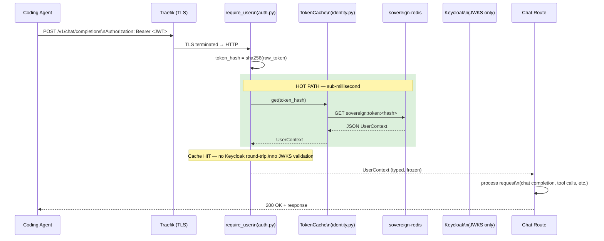
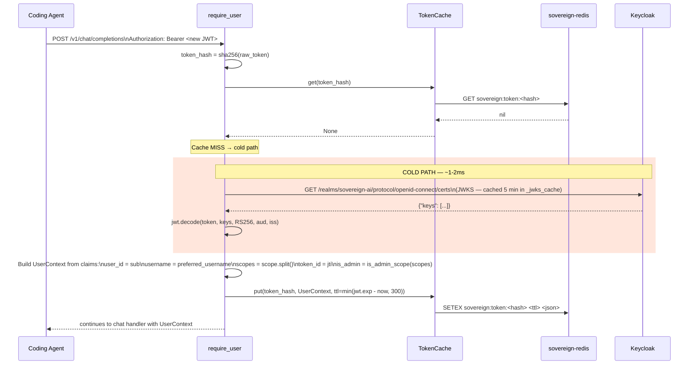
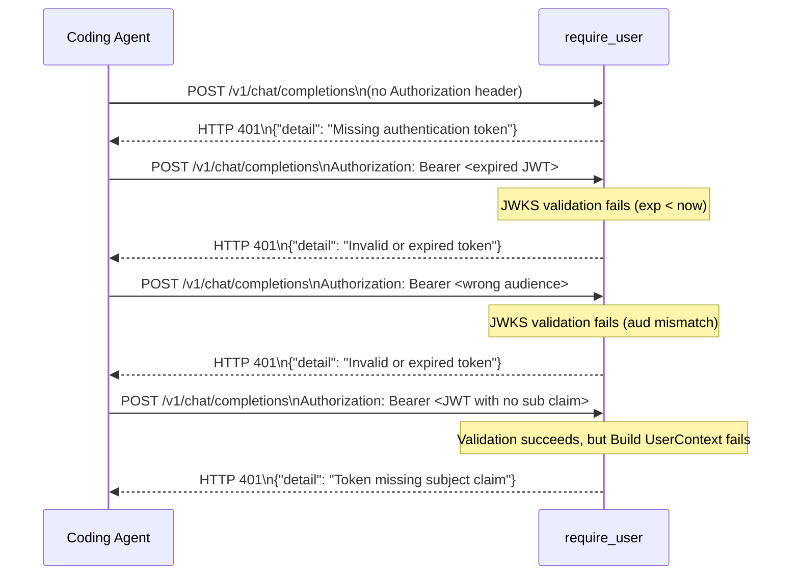
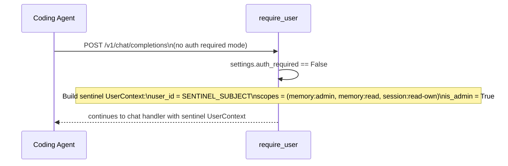

# Sequence Diagram: OAuth2 + Identity Resolution (DESIGN §15)

> **Updated 2026-04-11** for the §15 refactor: identity is delegated entirely
> to Keycloak, with a Redis-backed token cache for the hot path. The
> previous PAT model from Phase 0/1 was dropped via Alembic migration 004
> (forward migration). See `ADR-026` §15 for the
> mental model.

## Token acquisition (OAuth2 device flow — for human users)

The agent (OpenCode, Continue, Roo Code) runs an interactive `auth login`
once per machine. The user authenticates against Keycloak via a browser,
the agent caches the resulting JWT plus a refresh token, and uses the
access token on every subsequent request.

## Token acquisition (OAuth2 client_credentials — for service accounts)

Headless agents (CI jobs, automation) use a Keycloak service account
client with `private_key_jwt`. Same outcome as the device flow — a
standard Keycloak JWT. **No PATs anywhere in the system after the §15
refactor.**

## Identity resolution at the proxy (the §15 hot/cold path)

Every authenticated request flows through `require_user`. Hot path is a
Redis cache lookup (sub-millisecond). Cold path validates the JWT against
Keycloak's JWKS endpoint, builds a typed `UserContext`, and writes it to
the cache for subsequent requests.

### Cold path — first request with a new token

### Failure cases

### Bypass mode (development / migration window)

When `SOVEREIGN_AUTH_REQUIRED=false` (the default during the multi-user
migration window), `require_user` short-circuits the entire flow and
returns a sentinel `UserContext`. No JWKS fetch, no cache lookup, no
Keycloak round-trip. Used so existing tests and dev workflows continue
to work unchanged until Phase 5 flips the flag.

## Token revocation under the new model

Two layers of revocation, with different latencies:

1. **Keycloak-side revocation** (admin disables a user, removes a client,
   rotates a key) takes effect immediately for *new* token issuance and
   *cold path* validations. Tokens already in the Redis cache continue
   to validate until their cache TTL expires.
2. **Cache-side eviction** happens automatically on TTL (default 300s).
   Manual eviction via `TokenCache.invalidate(token_hash)` is available
   for the future logout endpoint.

**Maximum revocation latency:** the cache TTL (5 minutes by default).
This is a deliberate trade-off for performance — see DESIGN §15.6 for
the full reasoning. Tighter revocation is one config flip away
(`SOVEREIGN_TOKEN_CACHE_TTL_SECONDS=60`).

## Scope vocabulary

Scopes come from the Keycloak realm — NOT from a local roles→scopes
mapping table. The realm administrator configures which OAuth2 scopes
are granted to which clients via the Keycloak admin console. The
`scope` claim in the JWT is authoritative.

| Scope | Granted to | What it allows |
|---|---|---|
| `memory:read` | every authenticated user | call `recall_*` tools (when memory-as-tools lands) |
| `memory:read-decisions` | members + senior | search ADRs specifically |
| `memory:read-sessions` | senior + admin | read past chat sessions |
| `memory:admin` | admin only | full memory access; bypass scoping |
| `admin:tokens:read` | admin only | list issued tokens |
| `admin:tokens:write` | admin only | issue / revoke tokens (when implemented) |
| `admin:audit:read` | admin + auditor | read the immutable audit trail |
| `session:read-own` | every authenticated user | read your own session history |

`is_admin` in the resolved `UserContext` is derived programmatically
via `is_admin_scope()` — true if any `memory:admin` or `admin:*` scope
is present.
