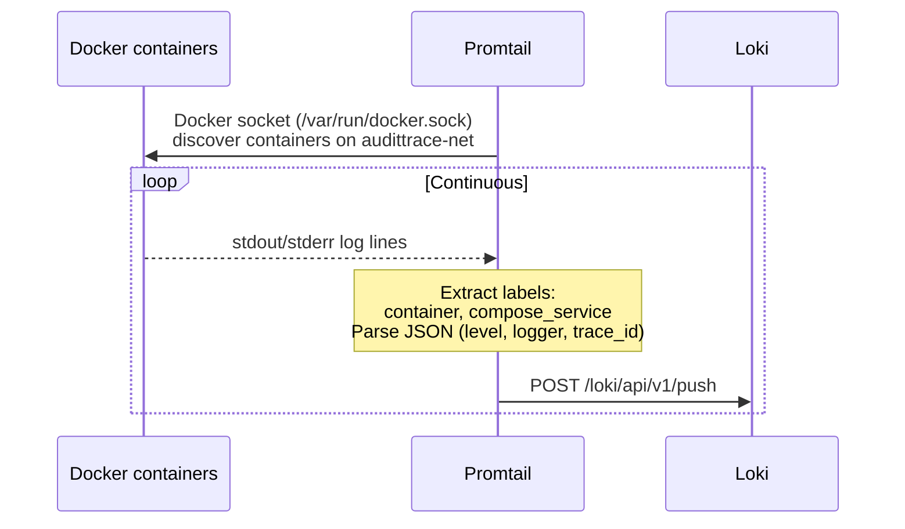
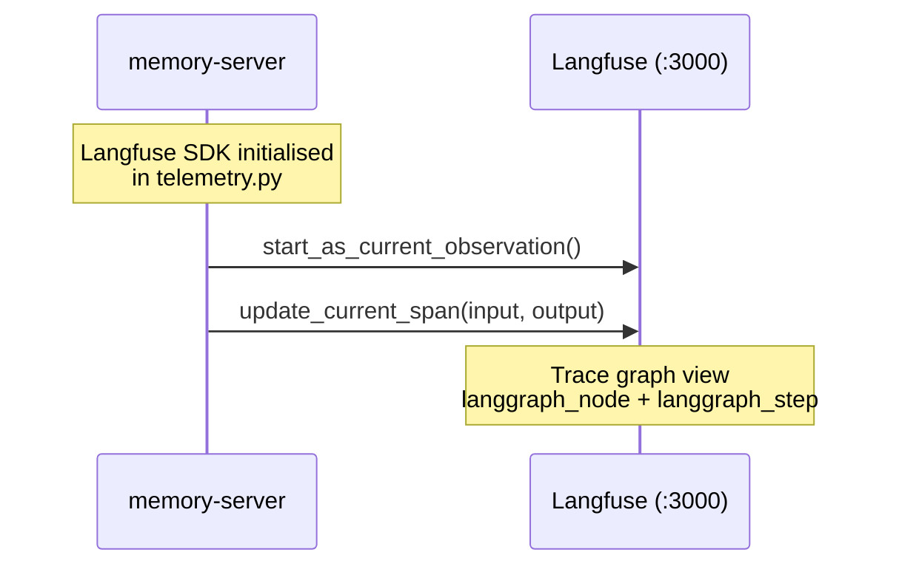
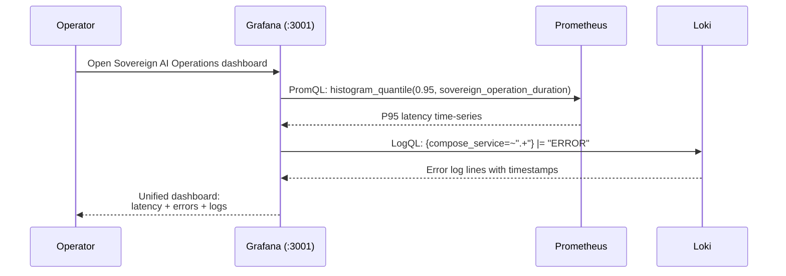

# Sequence Diagram: Observability Data Flow (ADR-028)

Three parallel telemetry paths: metrics via OTel Collector to Prometheus,
logs via Promtail to Loki, traces via Langfuse SDK (unchanged from ADR-021.2).

## Metrics Path — OTel Collector to Prometheus


## Infrastructure Scraping — Prometheus pulls from native endpoints

```mermaid
sequenceDiagram
    participant Prom as Prometheus
    participant Istio Gateway as Istio Gateway (:8080)
    participant Llama as llama-server (:11435)
    participant MinIO as MinIO (:9000)

    loop Every 15s
        Prom->>Istio Gateway: GET /metrics
        Istio Gateway-->>Prom: request rate, latency, status codes

        Prom->>Llama: GET /metrics
        Llama-->>Prom: tokens/sec, prompt eval, KV cache

        Prom->>MinIO: GET /minio/v2/metrics/cluster
        MinIO-->>Prom: bucket ops, disk usage, API latency
    end
```

## Log Aggregation — Promtail to Loki



## Trace Path — Langfuse SDK (unchanged)



## Grafana — Unified query layer



## Full Data Flow Summary

```
memory-server
  ├── OTLP/HTTP ──► OTel Collector ──► Prometheus (metrics)
  ├── Langfuse SDK ──► Langfuse (traces) [ADR-021.2]
  └── stdout ──► Promtail ──► Loki (logs)

Prometheus ◄── scrape ── Istio Gateway, llama-server, MinIO

Grafana
  ├── PromQL ──► Prometheus
  └── LogQL ──► Loki
```
