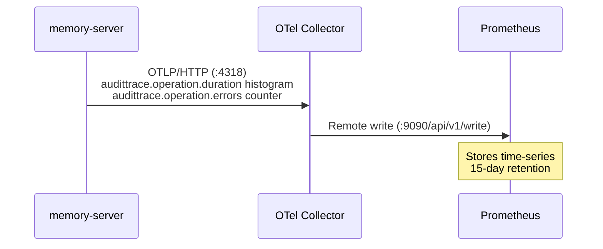
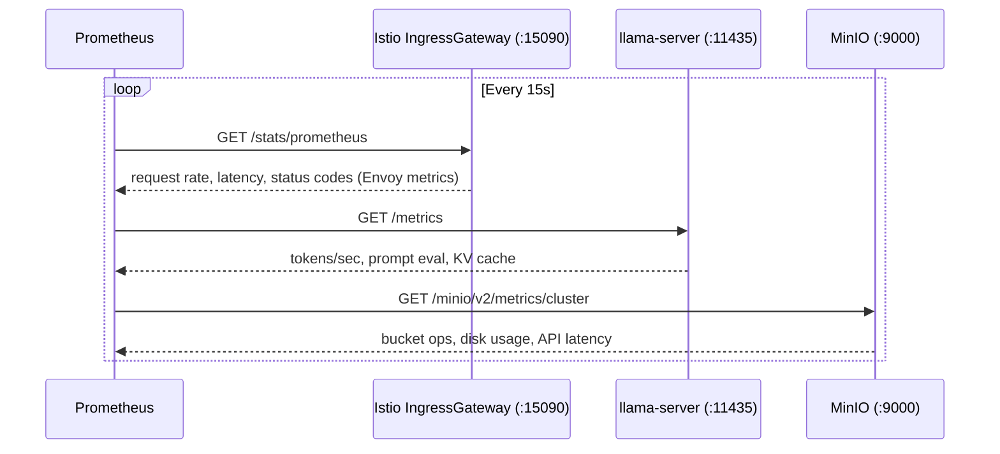
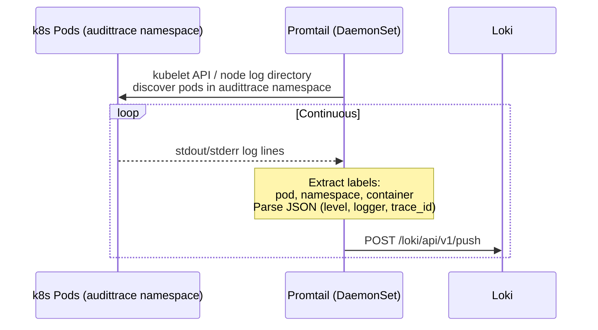
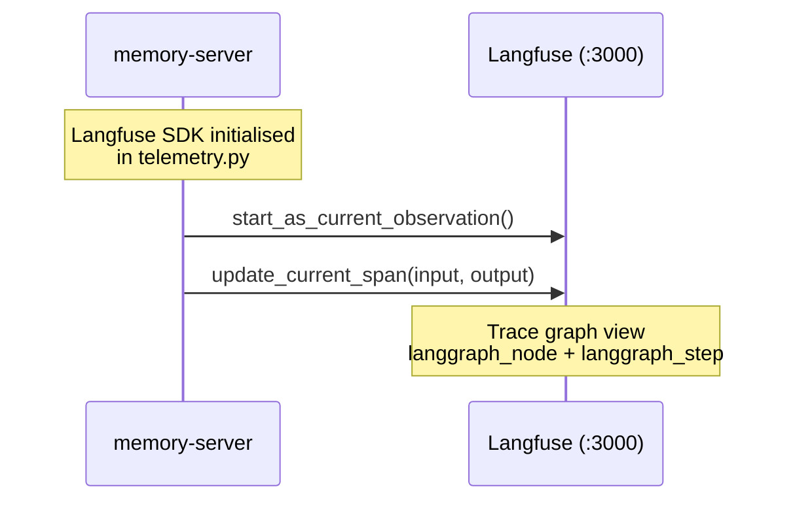
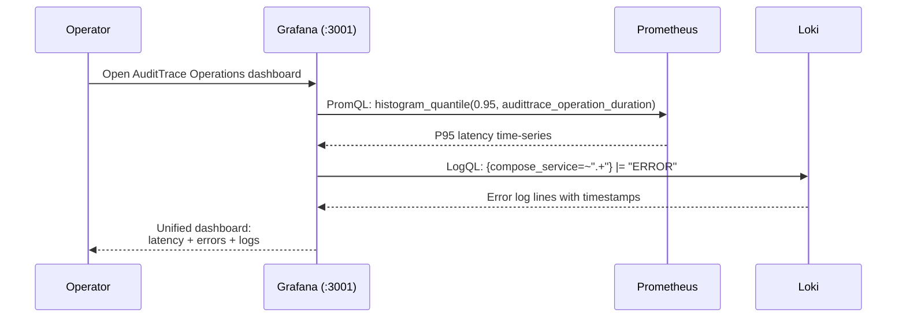

# Sequence Diagram: Observability Data Flow (ADR-028)

Three parallel telemetry paths: metrics via OTel Collector to Prometheus,
logs via Promtail to Loki, traces via Langfuse SDK (unchanged from ADR-021.2).

## Metrics Path — OTel Collector to Prometheus



## Infrastructure Scraping — Prometheus pulls from native endpoints



## Log Aggregation — Promtail to Loki



**OTel Collector** runs as a DaemonSet inside the `audittrace` namespace,
receiving OTLP from the audittrace-server sidecar (mesh-local traffic).
Envoy sidecars on every pod also emit their own metrics to Prometheus
via the `/stats/prometheus` scrape endpoint.

## Trace Path — Langfuse SDK (unchanged)



## Grafana — Unified query layer



## Full Data Flow Summary

```
memory-server
  ├── OTLP/HTTP ──► OTel Collector ──► Prometheus (metrics)
  ├── Langfuse SDK ──► Langfuse (traces) [ADR-021.2]
  └── stdout ──► Promtail ──► Loki (logs)

Prometheus ◄── scrape ── Istio IngressGateway, Envoy sidecars, llama-server, MinIO

Grafana
  ├── PromQL ──► Prometheus
  └── LogQL ──► Loki
```
