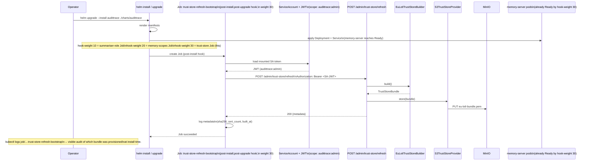

# Trust-store refresh (ADR-052)

This sequence covers the PAdES trust-store refresh flow introduced in ADR-052: `POST /admin/trust-store/refresh` (operator-explicit) plus the Helm post-install / post-upgrade hook Job that fires it once after deploy.

The trust store is the PEM bundle that `pyhanko-certvalidator` uses inside `_pdf_signature_status` (`src/audittrace/routes/memory.py`) to decide whether a signed PDF flips `signed_valid`, `signed_invalid`, `signed_untrusted`, or `signed_tampered`. Per ADR-052 §4 the bundle lives in MinIO at `memory-shared/trust-store/eu-lotl-bundle.pem` (default `S3TrustStoreProvider`).

Three viewpoints below: operator refresh happy path, first-deploy bootstrap via Helm hook, and the LOTL-unreachable failure mode.

## Operator refresh (happy path)

The operator (or an automated upstream caller) hits the admin endpoint with a JWT carrying the `audittrace:admin` scope. The endpoint synchronously runs the configured `Builder` (default `EuLotlTrustStoreBuilder`) and persists the resulting bundle via the configured `Provider` (default `S3TrustStoreProvider`).

```mermaid
sequenceDiagram
    participant Op as Operator (curl / CI / Helm hook)
    participant Admin as POST /admin/trust-store/refresh\n(routes/admin.py)
    participant DI as DependencyContainer
    participant Builder as EuLotlTrustStoreBuilder\n(services/trust_store.py)
    participant LOTL as EU LOTL\nec.europa.eu/tools/lotl/eu-lotl.xml
    participant TSL as Member-state TSLs\n(walked by pyhanko[etsi])
    participant Provider as S3TrustStoreProvider\n(services/trust_store.py)
    participant MIO as MinIO\nmemory-shared/trust-store/\neu-lotl-bundle.pem
    participant VC as _VALIDATION_CONTEXT singleton\n(routes/memory.py:415-466)

    Op->>Admin: POST /admin/trust-store/refresh\nAuthorization: Bearer <JWT scope=audittrace:admin>
    Admin->>DI: get_trust_store_builder()
    DI-->>Admin: EuLotlTrustStoreBuilder
    Admin->>Builder: build()
    Builder->>LOTL: GET eu-lotl.xml
    LOTL-->>Builder: XML + XAdES signature
    Builder->>Builder: lotl_to_registry(lotl_xml=None)\n(pyhanko[etsi] verifies XAdES\nusing bundled bootstrap keys)
    Builder->>TSL: GET each member-state TSL
    TSL-->>Builder: XML + XAdES signatures
    Builder->>Builder: filter to QC for ESig + QC for ESeal\nserialise to PEM bundle
    Builder-->>Admin: TrustStoreBundle(pem_bytes, metadata)
    Admin->>DI: get_trust_store_provider()
    DI-->>Admin: S3TrustStoreProvider
    Admin->>Provider: store(bundle)
    Provider->>MIO: PUT eu-lotl-bundle.pem
    MIO-->>Provider: ETag + version_id
    Provider-->>Admin: ok
    Admin->>VC: invalidate (next signature check rebuilds)
    Admin-->>Op: 200 {"sha256": "...", "builder_id": "eu_lotl",\n             "built_at": "2026-05-09T...", "cert_count": 612,\n             "source_url": "https://ec.europa.eu/tools/lotl/eu-lotl.xml"}

    Note over Op,VC: Next POST /memory/index call hits\nthe rebuilt _VALIDATION_CONTEXT;\nsigned_invalid → signed_valid for\ndocs whose CA is in the new bundle.
```

## First-deploy bootstrap (Helm post-install hook)

When the operator runs `helm install` or `helm upgrade`, the `templates/admin/job-trust-store-refresh.yaml` Job runs once after install/upgrade and hits the admin endpoint. This means the trust store is populated within seconds of deploy completing — without the operator needing to remember a manual step.

The hook is **opt-out** (`trustStore.bootstrap.enabled: true` in `values.yaml`). Air-gapped customers using `StaticTrustStoreBuilder` set it to false and seed the trust store with their own provisioning path.



## Failure mode — LOTL unreachable

When the EU LOTL endpoint is unreachable (network outage, EU-side service degradation, DNS failure), `EuLotlTrustStoreBuilder.build()` raises. The admin endpoint surfaces a 502 with the underlying error; the existing cached bundle in MinIO is **not** overwritten — refresh is best-effort by design.

```mermaid
sequenceDiagram
    participant Op as Operator (or hook Job)
    participant Admin as POST /admin/trust-store/refresh
    participant Builder as EuLotlTrustStoreBuilder
    participant LOTL as EU LOTL (unreachable)
    participant Provider as S3TrustStoreProvider
    participant MIO as MinIO\n(holds last-good bundle)

    Op->>Admin: POST /admin/trust-store/refresh
    Admin->>Builder: build()
    Builder->>LOTL: GET eu-lotl.xml
    LOTL--XBuilder: ConnectionError / 5xx / timeout
    Builder-->>Admin: raise TrustStoreBuildError(\n  reason="lotl_unreachable",\n  cause="...")
    Note over Admin: Provider.store() is NOT called.\nMinIO state unchanged.
    Admin-->>Op: 502 {"error": "trust_store_build_failed",\n             "reason": "lotl_unreachable",\n             "cause": "..."}

    Note over Op,MIO: Subsequent /memory/index calls continue to use\nthe last-good bundle from MinIO (loaded at\nprocess start by S3TrustStoreProvider.load()).\n\nOperator retries the endpoint when LOTL is back.\nNo signature_status regressions during the outage.

    Note over Op: For Helm-hook context: Job retries up to\nbackoffLimit=12 with backoff. If all fail,\nJob is marked Failed; helm install is marked\nFailed unless `helm.sh/hook-delete-policy:\nbefore-hook-creation,hook-succeeded` lets it\nbe cleaned up. Operator inspects the Job logs\nand retries once LOTL is reachable.
```

## Cross-references

- ADR-052 §5 — refresh trigger (admin endpoint + Helm hook).
- ADR-052 §6 — `pyhanko[etsi]` runtime dep, ImportError-guarded.
- ADR-049 — Test, Evidence, Reconstructibility Gate. Live-evidence captures (post-PR-3) include the API response, the `psql` row, the ChromaDB chunk metadata, the Tempo trace ID, and the MinIO listing showing the PEM bundle.
- `services/episodic.py:28-371` — the in-repo pattern (ABC + S3 impl + Mock impl) that `services/trust_store.py` mirrors.
- `templates/postgres/job-summariser-role.yaml` — the Helm post-install Job pattern that `templates/admin/job-trust-store-refresh.yaml` mirrors.
- `routes/memory.py:415-466` — `_VALIDATION_CONTEXT` singleton; PR 3 extends to read PEM via the configured Provider on first build and on cache invalidation.
