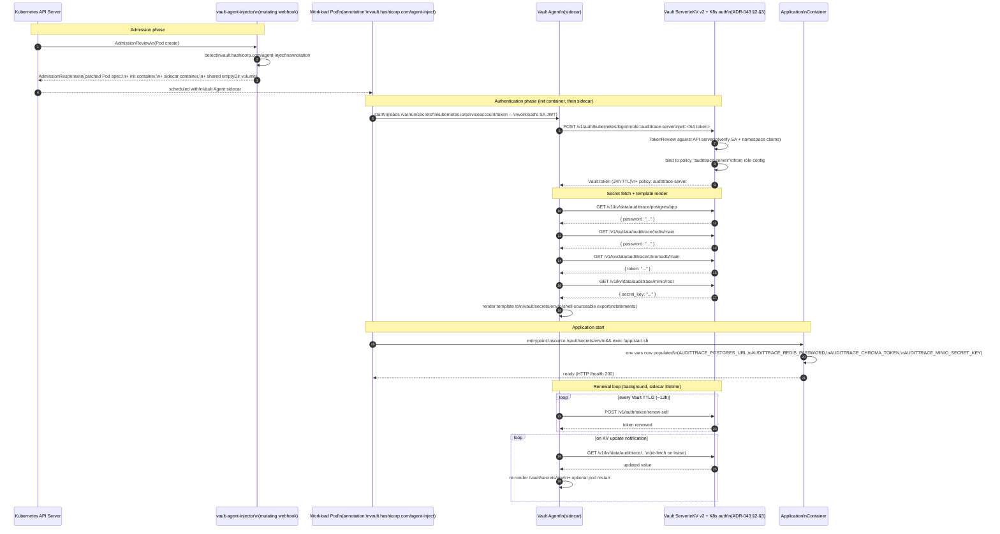

# Sequence Diagram: Vault Agent secret injection (ADR-043)

> **Added 2026-04-25** for ADR-043 (HashiCorp Vault as sole production
> secret store). Companion to the C4 Container + Deployment + Trust-
> boundary updates that landed in the same M1 commit.

## Context

When `vault.enabled=true`, every AuditTrace-owned workload pod
(memory-server, Keycloak, MinIO, summariser-job) gets a Vault Agent
sidecar injected by a mutating webhook. The Agent authenticates to
Vault using the workload's own ServiceAccount JWT, fetches the
secrets the workload's Vault role allows, renders them to a file
under `/vault/secrets/`, and the application reads from there.

**Critical invariant (ADR-043 §4):** secrets never enter the workload
container's environment variables, never appear in `kubectl describe
pod`, never end up in container manifests. The audit trail of "who
fetched what when" lives in Vault's audit device, not in K8s logs.

## Pod-start flow

The diagram below shows the secret journey from `kubectl create pod`
to the application's first read. The pod has the
`vault.hashicorp.com/agent-inject: "true"` annotation; the Vault
Agent Injector webhook sees it on admission and adds the sidecar.



## Why an entrypoint shim, not env-vars-from-Secret?

The shim (`source /vault/secrets/env && exec ...`) is the simplest
mechanism that satisfies the ADR-043 §4 invariant. The alternative
patterns each have a hole:

| Pattern | Why not |
|---|---|
| `valueFrom.secretKeyRef` referencing a K8s Secret | The Secret has to exist and contain the value. Either Helm renders it (= secret in `values.yaml`, which is what we are leaving) or an external operator creates it (= ESO/VSO scope, deferred). |
| `envFrom.secretRef` (bulk) | Same issue. |
| Vault Agent's "render-as-K8s-Secret" feature | Does not exist. Vault Agent renders to files; ESO/VSO is the K8s-Secret-rendering tier. |
| Application reads `*_FILE`-suffixed env vars (12-factor convention) | Requires patching `config.py` to support every secret's `_FILE` form. Larger blast radius; deferred until M2 settles. |

The entrypoint shim is local to the Pod spec, leaves the application
unchanged, and produces an identical runtime environment to the
pre-Vault path. The trade-off is that secrets exist in the shell's
environment briefly while the app loads — but only inside the
container's PID 1, never in the K8s manifest, never in `kubectl
describe`, never in logs.

## Operator workflow (how the secrets get there in the first place)

This sequence assumes Vault is unsealed and the KV mount is populated.
That state is established by the operator, once, after install:

```mermaid
sequenceDiagram
    autonumber
    participant Op as Operator\n(human)
    participant Helm as helm CLI
    participant K8s as k3s API server
    participant V as Vault server\n(uninitialised)
    participant CM as ConfigMap\naudittrace-vault-policies\n(in-cluster)

    Op->>Helm: helm install ... --set vault.enabled=true
    Helm->>K8s: apply manifests\n(Vault StatefulSet,\nInjector Deployment,\npolicy ConfigMap, etc.)
    K8s-->>V: pod scheduled (sealed)

    Op->>V: kubectl exec ... vault operator init\n(via vault CLI inside the pod)
    V-->>Op: 5 shamir keys\n+ root token (saved offline)

    Op->>V: kubectl exec ... vault operator unseal <key>\n(×3, threshold=3)
    V-->>Op: unsealed

    Op->>Op: export VAULT_TOKEN=<root>
    Op->>+CM: scripts/setup-vault.sh
    Note over CM: read policies + role bindings
    CM-->>Op: HCL + role env data

    loop for each policy/role
        Op->>V: vault policy write <name> <hcl>
        V-->>Op: ok
        Op->>V: vault write auth/kubernetes/role/<name> <bindings>
        V-->>Op: ok
    end

    loop for each KV path (postgres, redis, chromadb, minio, summariser)
        Op->>V: vault kv put kv/audittrace/<service>/<key> <value>
        V-->>Op: ok
    end

    Op-->>Op: keycloak admin pw\n(NOT seeded from repo —\noperator types directly)
    Op->>V: vault kv put kv/audittrace/keycloak/admin password=<NEW>
    V-->>Op: ok

    Op->>Helm: helm upgrade ...\n(workload pods restart;\nVault Agent sidecars start;\nsecrets flow per the first diagram)
```

## Trust-boundary deltas (overlay on the C4 Container view)

The Vault commit pulls the "secrets" boundary line **inward**. Before
ADR-043 the secrets path crossed:

```
operator → values.yaml → Helm render → K8s Secret → workload env var
                                        └─ visible in kubectl describe
                                        └─ visible in K8s API audit log
```

After ADR-043 the secrets path is:

```
operator → Vault CLI → Vault audit device
                       │
                       └─ at pod start:
                          workload SA JWT → Vault → file mount → app
                          └─ never in env, never in describe, never in K8s audit
```

The K8s API server has zero visibility into the secret values now;
all auditable events live in Vault's audit device. This is what the
"sterile `kubectl describe`" claim in ADR-043 §Consequences refers to.

## See also

- ADR-043 — decision record, all numbered sections referenced above
- `scripts/setup-vault.sh` — the operator-run script implementing the
  second diagram
- `charts/audittrace/templates/vault/configmap-policies.yaml` — the
  ConfigMap the script reads
- `~/work/audittrace-private/runbooks/02-vault-unseal.md` — the
  operator's break-glass runbook (private)
