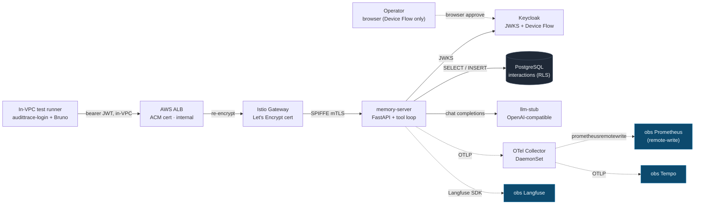

# Cloud Tier-0 validation walkthrough — "the rig behaves like the laptop"

**Audience:** architects, auditors, prospective customers, and anyone asking *"does this actually deploy and behave the same on a real cloud substrate, not just the author's laptop?"* This document shows — with real commands and real output from a **from-scratch AWS deployment** — that the AuditTrace-AI reconstructibility contract proven locally in [reconstructibility-walkthrough.md](reconstructibility-walkthrough.md) holds identically in the cloud: Device-Flow auth → memory-server → LLM → audit row → telemetry → metrics, with a **proper CA certificate chain on every hop**.

**TL;DR.** A single `tofu apply` stands up the whole platform on EKS. An operator authenticates once (OAuth2 Device Flow, browser), and from an **in-VPC test runner** every public-API surface is exercised: a chat completion returns `200`, the call lands as an RLS-scoped audit row, and HTTP-server metrics flow over the in-mesh → remote-write path into the observability stack. The validation runs at **Tier-0** — the LLM is an in-cluster OpenAI-compatible **stub** (no GPU) — so the *whole-solution wiring* (auth, routing, RLS, audit, telemetry, metrics) is proven cheaply and repeatably. Real GPU inference is a separate **Tier-2** concern, proven independently.

---

## What Tier-0 validates — and what it deliberately does not

| Tier | What it exercises | LLM | Cost shape |
|---|---|---|---|
| **Tier-0 (this doc)** | whole-solution **wiring**: Keycloak Device Flow → JWT → Istio mTLS → memory-server → RLS audit row → OTLP traces + remote-write metrics → obs stack | in-cluster **stub** (deterministic, OpenAI-shaped) | no GPU — cheap, repeatable |
| Tier-2 | real inference throughput, token/s, KV cache | real GPU model (Qwen 3.6-35B) | GPU instance |

Tier-0 answers *"is every wire connected correctly on a real cloud deployment?"* Substituting the stub for the model is the whole point: a wiring bug surfaces in minutes without burning GPU time. The model is the one component already proven elsewhere (the laptop walkthrough + an AMI smoke test); everything *around* it is what cloud deployment can get wrong.

---

## The cloud topology



Two properties distinguish this from the laptop:

1. **Zero public ingress.** The ALB is internal; the EKS API endpoint is private. Operators reach the cluster through an SSM-brokered path, never the open internet.
2. **Push, not scrape, for metrics.** A remote obs Prometheus cannot scrape into a private cluster, so the otel-collector **pushes** application metrics via `prometheusremotewrite` — the cloud analogue of the laptop's scrape model (see Hop 5 / the §"Metrics" note).

---

## The certificate chain — every hop, real CAs

The defining cloud requirement: no self-signed anything. Each hop terminates and re-originates TLS against a real CA.

| Hop | Certificate | Issuer | How it's provisioned |
|---|---|---|---|
| client → ALB | `audittrace-loadtest.allaboutdata.eu` | **ACM** (`O=Amazon`) | AWS-managed, attached to the ALB HTTPS listener |
| ALB → Istio gateway (re-encrypt) | gateway cert | **Let's Encrypt** (`O=Let's Encrypt, CN=R13`) | cert-manager + Route53 **DNS-01** ClusterIssuer |
| in-mesh (gateway → pods, pod → pod) | SPIFFE workload identity | **istiod** mTLS, `STRICT` | Istio CA |
| chart → obs (traces, metrics) | obs endpoints | **ACM** (NLB) | `observability.external.scheme=https` |

Verified live this run:

```
$ kubectl get certificate audittrace-gateway-cert -n istio-system
NAME                      READY   SECRET           AGE
audittrace-gateway-cert   True    audittrace-tls   ...
# issuer on the served cert:
issuer=C=US, O=Let's Encrypt, CN=R13
```

ACM public certificates cannot be exported into a cluster — that is exactly why the in-mesh gateway hop uses cert-manager + Let's Encrypt rather than reusing the ALB's ACM cert.

---

## The in-VPC validation runner

By design, **everything but the human browser approval runs in-VPC** on a dedicated test runner that reaches the internal ALB directly (no laptop, no tunnel latency in the hot path). The runner holds `audittrace-login` and the Bruno collection; the operator's laptop only renders the OAuth approval page. This is both the right operator-ergonomics shape and the foundation for later load testing.

---

## Hop 1 — Authentication (OAuth2 Device Flow, ADR-032)

The operator runs the Device Flow once from the runner; Keycloak issues a scoped JWT. The token is verified — without printing the credential — by decoding only its claims:

```
user=luis   iss=<cloud Keycloak realm>/realms/audittrace
scopes= openid memory:episodic:read memory:procedural:read memory:semantic:read
        memory:conversational:read-own memory:episodic:write
        audittrace:context audittrace:query audittrace:audit
```

What this proves: the cloud Keycloak realm imported cleanly, the Device Flow client is live, and the memory-server validates the token against the **in-cluster** JWKS endpoint (`http://…-keycloak:8080/…/certs`) while accepting the deployment hostname as a valid issuer. JWKS is fetched in-cluster; the issuer is matched against the configured accept-list — these are decoupled so a private cluster never has to reach its own public hostname to validate a token.

---

## Hop 2 — The chat completion (the mandatory LLM call, through the stub)

```
$ curl -sk https://audittrace-loadtest.allaboutdata.eu/v1/chat/completions \
    -H "Authorization: Bearer $TOKEN" -H "content-type: application/json" \
    -d '{"model":"audittrace-default","messages":[{"role":"user","content":"cloud tier-0 e2e probe"}]}'
```

```json
{
  "id": "chatcmpl-stub",
  "object": "chat.completion",
  "model": "audittrace-default",
  "choices": [{"index": 0, "message": {"role": "assistant", "content": "bruno"}, "finish_reason": "stop"}],
  "usage": {"prompt_tokens": 506, "completion_tokens": 1, "total_tokens": 507}
}
```
```
HTTP 200
```

The traversal: in-VPC runner → ALB (ACM) → re-encrypt → Istio gateway (Let's Encrypt) → SPIFFE mTLS → JWT `AuthorizationPolicy` → memory-server → memory augmentation → stub → `"bruno"`.

`prompt_tokens=506` is the tell that **memory augmentation actually ran**: the stub reports a token count derived from the *real* request payload (system prompt + injected memory context), not a fixed constant. A bare prompt would report a handful of tokens; 506 means the memory-server assembled and forwarded the augmented context. This is the OpenAI-schema contract holding byte-for-byte on the cloud path (`feedback_openai_schema_inviolate`).

---

## Hop 3 — The public-API contract (Bruno pack, run from the runner)

The Bruno collection drives every public surface with the scoped JWT. Core results this run:

| Folder | Result | What it proves |
|---|---|---|
| **chat** | ✅ PASS | OpenAI shape preserved, `finish_reason=stop`, non-empty answer, **`prompt_tokens > 100` (augmentation ran)** |
| **context** | ✅ PASS | `layer_stats` names the four memory layers |
| **audit** | ✅ PASS | audit-envelope shape |
| **session** | ✅ PASS | session-envelope shape |

The `chat` folder's `prompt_tokens > 100` assertion is the same check that infers "context was injected from memory" — it passes against the cloud deployment exactly as against a real model, because the stub reports a payload-scaled token count.

*(Two folders carry known, non-wiring gaps in this Tier-0 realm: the `health` pack's `/metrics` probe needs the `audittrace:admin` scope, which this operator token does not carry; the `memory` write/scan operations depend on additional write scopes + the content-control scan pipeline. Both are scope/feature-coverage items, not auth-or-routing defects — the core chain is green.)*

---

## Hop 4 — Reconstructibility: the audit row (EU AI Act Article 12)

Every call lands a synchronous, RLS-scoped row. Pulled through the public browser endpoint with the operator's own token:

```
$ curl -sk "https://audittrace-loadtest.allaboutdata.eu/interactions?limit=1" -H "Authorization: Bearer $TOKEN"
```
```json
{
  "id": 3,
  "user_id": "<Keycloak sub>",
  "model": "audittrace-default",
  "status": "success",
  "trace_id": "<32-hex OTel id>"
}
```

The row carries `user_id` (the Keycloak `sub`), `status`, `model`, and the `trace_id` that links the request to its traces — the same five-identifier reconstructibility contract documented for the laptop, now persisted on the cloud Postgres with RLS enforcing per-user isolation at the database layer.

---

## Hop 5 — Telemetry: HTTP-server metrics reach the obs Prometheus

This is the cloud-specific path the laptop never exercises. The otel-collector pushes application metrics via `prometheusremotewrite` to the obs Prometheus (which runs with `--web.enable-remote-write-receiver`). After driving traffic through the Bruno pack, the metrics are queryable in the obs Prometheus:

```
$ curl -sk "https://<obs-fqdn>:19090/api/v1/query?query=http_server_request_duration_seconds_count"
http_server_request_duration_seconds_count : 29 series
sovereign_operation_duration_seconds_count : 43 series

  /health                 status=200  count=89
  /v1/chat/completions    status=200  count=2
  /memory/conversational  status=200  count=1
```

These are the exact series the Grafana operator dashboards query (`http_server_request_duration_seconds_count` by route/status; `sovereign_operation_duration_seconds_bucket` by operation) — so the "Request Latency / HTTP Request Rate / Operation Duration" panels populate. The metric names carry no scrape-added `job`/`instance` labels, and the dashboards aggregate by `le`/`operation`/`http_route`, so the push path is label-compatible with the scrape path the laptop uses.

> **Why metrics need a push path in the cloud.** On the laptop, the obs Prometheus *scrapes* the in-cluster otel-collector over a host NodePort. A managed obs Prometheus cannot reach into a private EKS cluster that way, so the chart's otel-collector gains a `prometheusremotewrite` exporter (gated on `observability.external.prometheusHost`) that **pushes** — mirroring how traces already push to Tempo. Empty `prometheusHost` keeps the laptop scrape model unchanged.

---

## The reconstructibility contract — unchanged on the cloud

Every hop above carries the **same** `user_id` and `trace_id`. The cross-link table from the laptop walkthrough applies verbatim — Postgres RLS scopes `/interactions` to the caller, the `trace_id` links the row to Tempo/Langfuse, and the obs metrics carry the route/status dimensions. The contract — *given one identifier and a timestamp, reconstruct who asked what, what the model answered, and which datastores were touched* — is satisfied on a from-scratch cloud deployment, not just the development laptop. That is the claim the [Sovereignty-Reconstructibility Gap](reconstructibility-walkthrough.md) makes, validated against the substrate a customer would actually run.

---

## Honest deltas vs. the laptop walkthrough

- **LLM is stubbed (Tier-0).** Answers are deterministic (`"bruno"`); there is no real reasoning trace. Real inference + token/s is the Tier-2 concern, proven separately.
- **Scope/feature coverage gaps** noted in Hop 3 (`/metrics` admin scope; memory-write + content-control scan path) are tracked follow-ups, not wiring defects.
- **Operator-access mechanics** (how the browser reaches a private-cluster Keycloak, the in-VPC runner provisioning) live in the private operator runbook, not here — this document is the architecture-and-proof narrative.

---

## Reproduce

The full bring-up + teardown sequence (substrate apply → obs bootstrap → chart install → in-VPC runner provisioning → Device-Flow login → Bruno pack → metrics verification → destroy + sweep) is captured in the private deployment repo's operator runbook (`operator/aws/`). The chart and stub that make Tier-0 possible are public: `charts/audittrace/` (the `llmStub` component + the `prometheusremotewrite` exporter) and `images/llm-stub/`.

## References

- [reconstructibility-walkthrough.md](reconstructibility-walkthrough.md) — the laptop counterpart; the cross-link table + identifier model apply here verbatim
- **ADR-008** — TLS termination + cert chain posture for cloud load balancers
- **ADR-010** — zero public ingress; private EKS endpoint; operator access path
- **ADR-026** — multi-user identity, RLS posture, scoped wrappers
- **ADR-028 / ADR-045** — observability aggregation (FQDN-only egress; OTLP + remote-write)
- **ADR-029** — end-to-end audit trail + `/interactions` browser
- **ADR-032** — OAuth2 Device Flow for human operators
- **ADR-035** — package rename (legacy `sovereign_*` metric names preserved)
- **ADR-049** — test + evidence + reconstructibility gate (the discipline behind this validation)
