# Reconstructibility walkthrough — one user request, end-to-end

**Audience:** regulators, auditors, architects, prospective customers. This document shows — with real commands and real output from the running system — how a single OpenCode (or any OpenAI-compatible) user request is persisted and observable across every layer of AuditTrace-AI. It is the operational proof behind the **EU AI Act Article 12** (reconstructibility) and **GDPR Article 44** (data sovereignty) claims.

**TL;DR.** Given a request, you can reconstruct *who asked what, what memory was consulted, what the model answered, how long each step took, and which rows in which datastores were touched* — in four API calls. The audit trail stops exactly where the memory-server's process boundary ends (**ADR-037**): agent-side tools executed by the client (bash, read, edit, grep, ...) are the client's concern, not ours.

---

## The shape of the audit trail

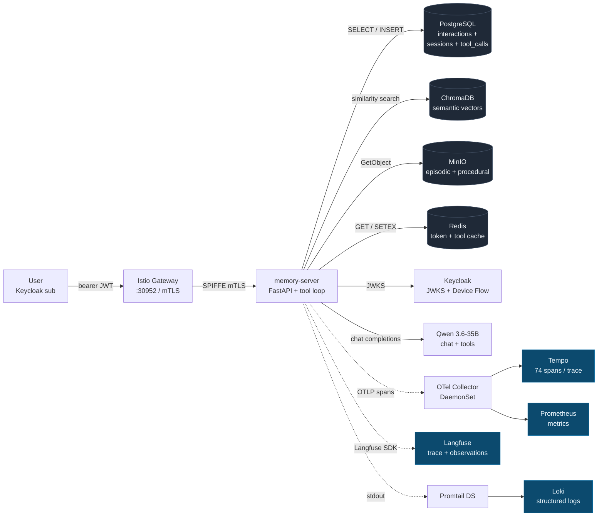

Every arrow carries the same `trace_id` + `user_id` + `session_id`. The three solid-line arrows from `memory-server` to the four stores are the request path. The three dashed observability lines persist the request for audit.

---

## Scenario

A user fires one chat request against `POST /v1/chat/completions`. The prompt deliberately triggers two memory tools (`recall_decisions` and `recall_semantic`) so every layer wakes up.

**The request:**

```bash
BEARER=$(scripts/audittrace-login --show)     # OAuth2 Device Flow, ADR-032
curl -sk \
  -H "Authorization: Bearer $BEARER" \
  -H "Content-Type: application/json" \
  -H "X-Project: reconstructibility-demo" \
  -X POST https://audittrace.local:30952/v1/chat/completions \
  -d '{
    "model": "qwen3.6-35b-a3b",
    "stream": false,
    "messages": [{"role": "user", "content":
      "Consult recall_decisions and recall_semantic to answer: what did ADR-027 decide about memory storage? Keep it to two short sentences."
    }]
  }'
```

**The five identifiers that link every system downstream:**

| Identifier | Value (this run) | Emitted by |
|---|---|---|
| `user_id` | `0b0cdd4d-04c3-428f-ab9d-37b47429c381` | Keycloak `sub` claim on the JWT |
| `session_id` | `curl-2026-04-18-8eb7151d4a63bfa79e8c88c53afae3e1` | `_compute_session_id(source, first_user, user_id)` — sha256 over the tuple |
| `interaction_id` | `72` | Postgres `interactions.id` serial |
| `trace_id` | `bf8373a8539e2d908e810adbcb00285d` | OpenTelemetry trace id, also used as Langfuse trace id |
| `response_id` | `chatcmpl-QGdqKxVD3TMmliKPDh1GFzKZxz7TjWQ7` | OpenAI schema, returned in the `id` field |

These five travel together through every hop. Any two of them let you cross-link two systems.

---

## Hop 1 — Postgres `/interactions` (authorised audit browser, RLS-scoped)

The first and simplest audit query: `GET /interactions` returns the structured row the chat handler persists synchronously on every request. Postgres RLS scopes results to the caller's `user_id` automatically (ADR-026 §RLS posture); the filter is enforced at the database layer, not the service layer.

```bash
$ curl -sk -H "Authorization: Bearer $BEARER" \
    "https://audittrace.local:30952/interactions?project=reconstructibility-demo&limit=1"
```

```json
{
  "id": 72,
  "user_id": "0b0cdd4d-04c3-428f-ab9d-37b47429c381",
  "session_id": "curl-2026-04-18-8eb7151d4a63bfa79e8c88c53afae3e1",
  "project": "reconstructibility-demo",
  "source": "curl",
  "status": "success",
  "failure_class": null,
  "error_detail": null,
  "duration_ms": 67565,
  "model": "Qwen_Qwen3.6-35B-A3B-Q4_K_M.gguf",
  "prompt_tokens": 2261,
  "completion_tokens": 1189,
  "timestamp": "2026-04-18T09:04:58.376665",
  "question": "Consult recall_decisions and recall_semantic to answer: what did ADR-027 decide about memory storage? Keep it to two short sentences.",
  "answer": "<think>\nThe semantic search returned..."
}
```

What this hop proves:

- **Who** — `user_id` is the Keycloak `sub`. Forgery is blocked by JWT signature verification + RLS — a bad actor cannot read another user's interactions even with a forged `?user_id=` query parameter.
- **What** — full prompt in `question`, full completion (including any `[tool_call]` lines the model emitted) in `answer`.
- **How much** — token counts and wall-clock `duration_ms`.
- **Success or failure** — `status` and `failure_class` (from migration 007 / ADR-033). Filter with `?status=failed` to enumerate upstream errors.

---

## Hop 2 — Postgres `/sessions` (Layer-3 conversational memory)

After the summariser runs (async, every 5 min on idle sessions), the conversational layer gains a row. The LLM reads this layer via the `recall_recent_sessions` memory tool (ADR-025, scope `memory:conversational:read-own`); operators read it via the REST browser.

```bash
$ curl -sk -H "Authorization: Bearer $BEARER" \
    "https://audittrace.local:30952/sessions?project=reconstructibility-demo&limit=1"
```

```json
{
  "id": "curl-2026-04-18-8eb7151d4a63bfa79e8c88c53afae3e1",
  "project": "reconstructibility-demo",
  "date": "2026-04-18T09:04:58.376665",
  "summary": "The user asked about ADR-027. The assistant cited MinIO object storage...",
  "key_points": "[\"ADR-027: MinIO object storage\", \"stateless memory layers\", \"SSE-S3 encryption at rest\"]",
  "model": "Mistral-7B-Instruct-v0.3-Q4_K_M.gguf",
  "user_id": "0b0cdd4d-04c3-428f-ab9d-37b47429c381",
  "summarized_at": "2026-04-18T09:09:00.123456"
}
```

The session row cross-references Hop 1 via the same `session_id`. The `key_points` JSON gives you a structured abstract; the `summary` gives you the prose version. Filter with `?summarised=false` to find freshly-created sessions awaiting summarisation.

---

## Hop 3 — Langfuse trace (LLM reasoning + tool invocations)

Langfuse stores the LLM view of the request: every tool call, every generation, every latency in the chain. Lookup is by `trace_id` — the same OpenTelemetry id that propagates through every span.

### List view — "one trace per request, filterable by user"

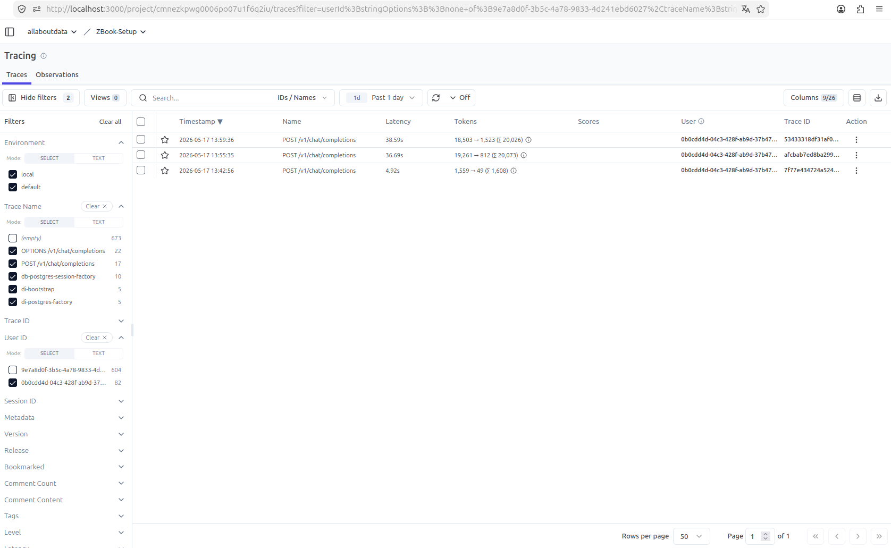

Every probe produces one trace; the list view shows `user`, `sessionId`, token counts, and latency at a glance. An auditor investigating a single user types the `sub` into the User filter and the list narrows to that user's activity only.

### Trace tree — structural shape

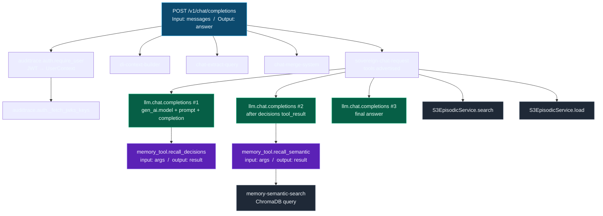

And the same tree, rendered by Langfuse's Timeline view:

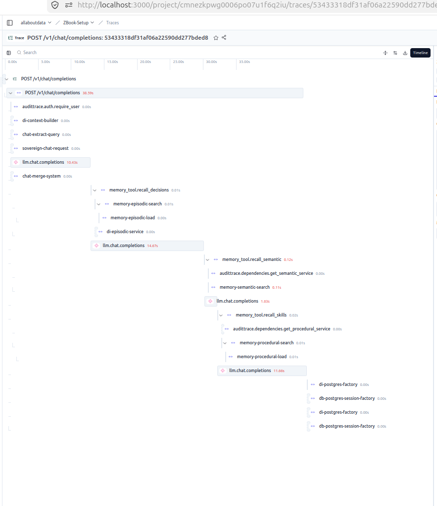

### The root observation — Input + Output populated

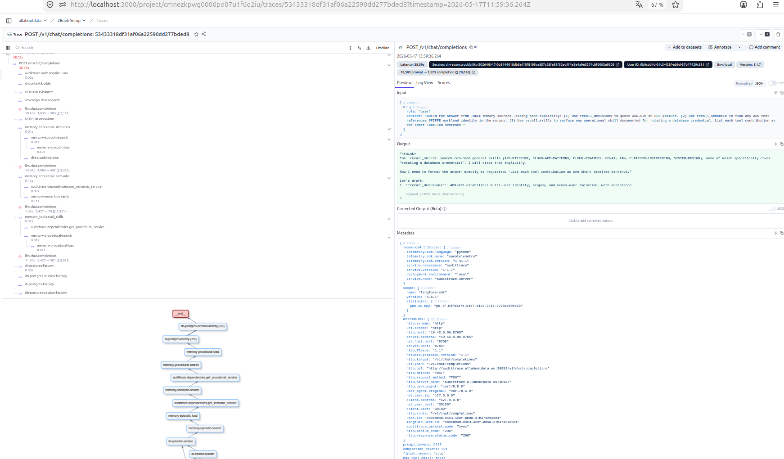

The Input panel shows the full `messages` array the caller sent. The Output panel shows the model's completion. Before commit `92e7847` this panel rendered `undefined` on every click — the pitch-killer. It is now populated on every observation in the tree.

### The Generation child — LLM reasoning preserved

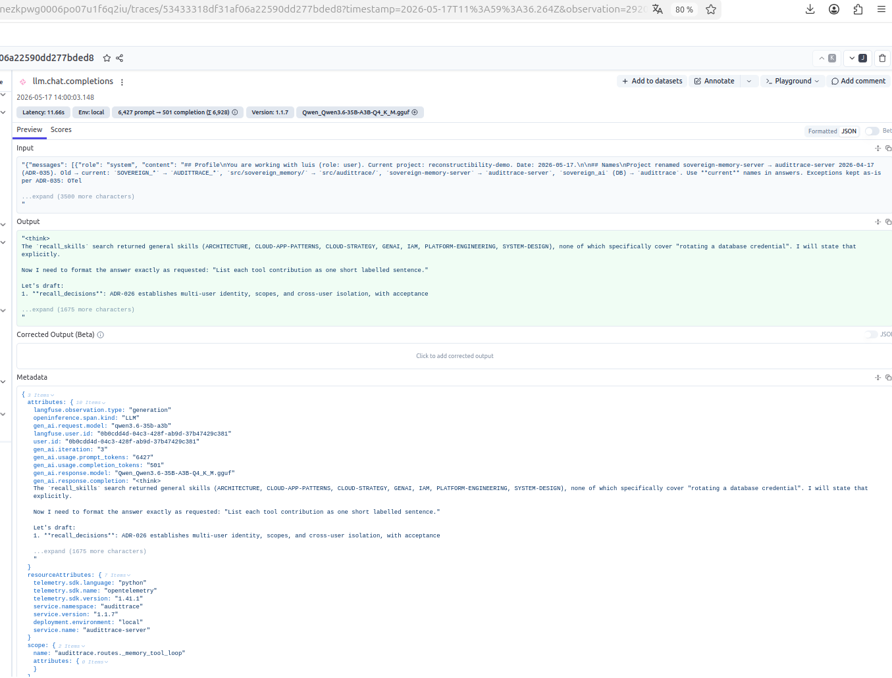

Each `llm.chat.completions` child is tagged `langfuse.observation.type=generation` and carries `gen_ai.request.model`, the prompt preview, the completion, and prompt/completion token usage (commit `fa5198a` for tools-mode, `2ef15c3` for inject-mode).

### The tool child — which memory layer fired, with what args, returning what

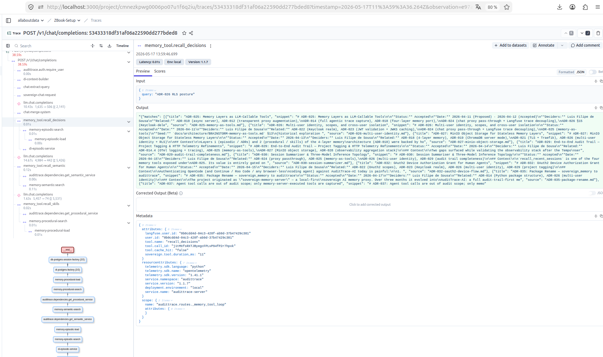

The `memory_tool.recall_decisions` observation (commit `65a5965`) shows the tool's name, the JSON args the LLM passed, the truncated result the tool returned, and `tool.cache_hit: false` (the execution actually touched the episodic layer, it wasn't served from Redis).

What this hop proves:

- **Which memory layers fired** — two tool spans (`recall_decisions`, `recall_semantic`) are visible as distinct children, each with the tool arguments the model passed and the result the tool returned.
- **How the model iterated** — three `llm.chat.completions` spans show the model round-tripped three times (initial question → after decisions result → after semantic result → final answer).
- **What the LLM saw and produced** — input and output populated at both trace level and on the root observation.
- **User attribution at every level** — every observation carries `langfuse.user.id` (commit `8d32440`) so the Langfuse user filter surfaces the whole tree, not just the root.

---

## Hop 4 — Tempo (full OTel call tree, every outbound edge)

Tempo stores the same trace with **every** span the OTel SDK and auto-instrumentors emitted — including database queries, Redis SETEX, MinIO S3 calls, and every outbound HTTP. For the probe in this walkthrough: **74 spans** (29 visible in the single-frame capture below; the rest are HTTP send/receive leaves collapsed under their parents).

### The flamegraph — one image, the whole call chain

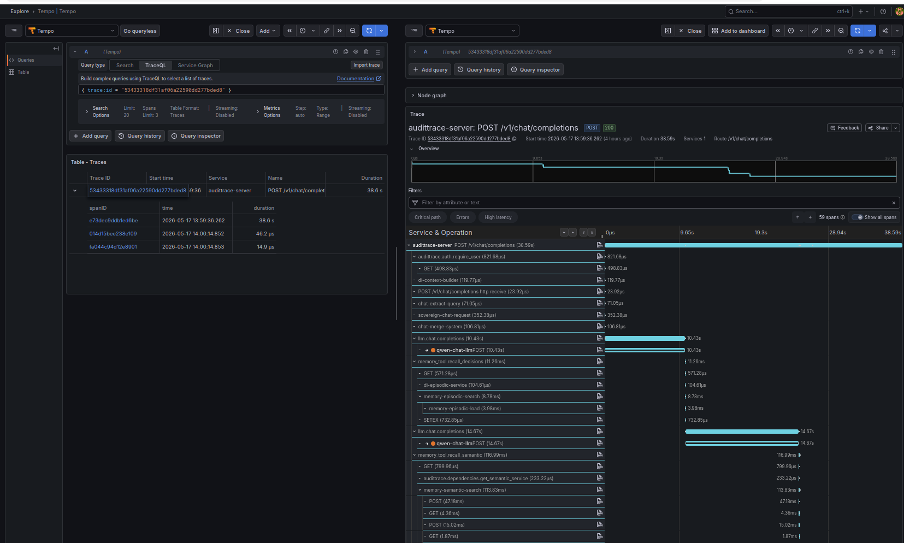

This is the image to put in the deck. It reads top-to-bottom as the request's life:

1. **`audittrace.auth.require_user`** (12.98 ms) — JWT validated against Keycloak. The nested `audittrace.auth._fetch_jwks_keys` + `GET` + `SETEX` show the JWKS fetch + Redis-cache write the first time a new kid is seen.
2. **`di-context-builder`** (156 μs), **`chat-extract-query`** (72 μs), **`chat-merge-system`** (121 μs), **`sovereign-chat-request`** (307 μs) — the proxy prep layer, all sub-millisecond.
3. **`llm.chat.completions`** (1 m 3 s — the dominant bar) — nested `qwen-chat-llm POST` shows the actual outbound LLM call with the `peer.service=qwen-chat-llm` label. Everything else on the trace is microseconds; LLM inference is the only slow thing, and that's the trade-off the user is paying for.
4. **Postgres writes** — `di-postgres-factory`, `db-postgres-session-factory`, `connect`, `SELECT audittrace` x3, `INSERT audittrace` — the audit-row persistence on the success path, all under 1 ms.
5. **`langfuse POST`** (9 ms) — the explicit `/api/public/ingestion` call (commit `e7005e0`) that writes trace-level Input/Output to Langfuse.

Every span carries `user.id` (commit `8d32440`), so `{ span.user.id = "<sub>" }` in TraceQL pulls only that user's activity out of Tempo.

### The service map — eight edges, named

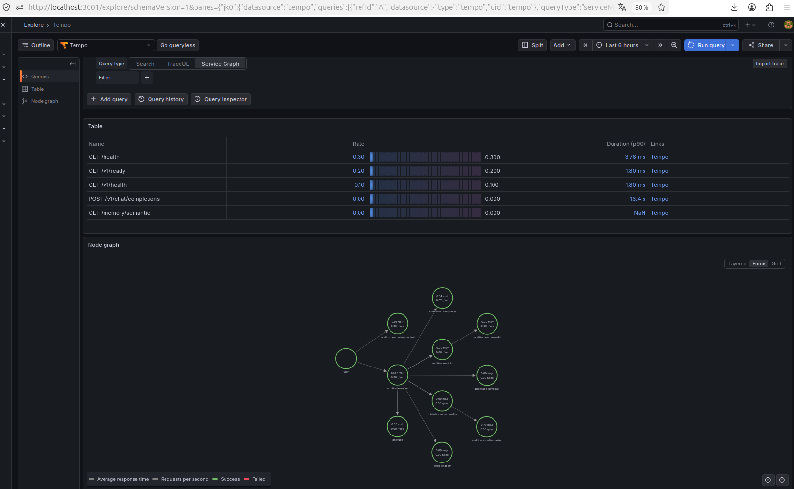

Tempo's metrics-generator derives a service graph from the spans' `peer.service` attributes. Every outbound edge memory-server makes is named, including the Langfuse ingestion edge (`peer.service=langfuse`, commit `93de0ca`):

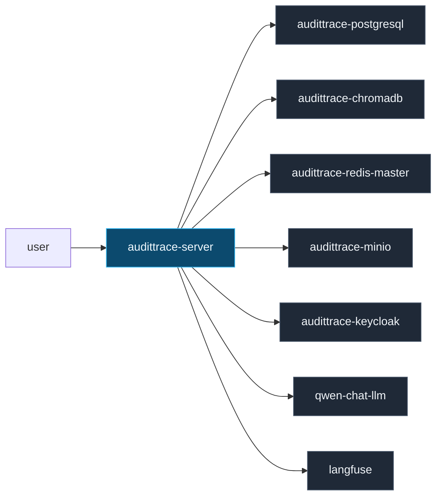

Inventory for the probe:

| Span name | Count | What it proves |
|---|---:|---|
| `POST /v1/chat/completions` | 1 | Root FastAPI span (wall time + HTTP attrs) |
| `audittrace.auth.require_user` | 1 | Auth gate latency |
| `audittrace.auth._fetch_jwks_keys` | 1 | Keycloak JWKS hit |
| `sovereign-chat-request` | 1 | Langfuse-recognised parent |
| `llm.chat.completions` | 3 | Three LLM round-trips (commit `fa5198a` / `2ef15c3`) |
| `memory_tool.recall_decisions` | 1 | Decisions tool invocation (commit `65a5965`) |
| `memory_tool.recall_semantic` | 1 | Semantic tool invocation |
| `memory-semantic-search` | 1 | ChromaDB similarity search (nested under tool) |
| `S3EpisodicService.search` / `.load` | 2 | MinIO episodic reads |
| `SELECT audittrace` | 4 | Postgres reads (incl. RLS-gated) |
| `INSERT audittrace` | 2 | `interactions` + `tool_calls` writes |
| `SETEX` | 3 | Redis cache writes (token cache + tool-result cache) |
| `POST` / `GET` / `connect` | 42 | Outbound HTTP (Qwen, nomic, Langfuse, Tempo, Loki) |

---

## Hop 5 — Loki (structured logs, per-pod, per-namespace)

Memory-server stdout is shipped to Loki by a Promtail DaemonSet (commit `20d0fd9`). Every line carries namespace + pod + container labels; the audit line for this request:

```bash
$ curl -s --get "http://192.168.1.231:3100/loki/api/v1/query_range" \
    --data-urlencode 'query={namespace="audittrace", pod=~"audittrace-memory-server.+"}' \
    --data-urlencode "start=$(date +%s -d '2 min ago')000000000" \
    --data-urlencode "end=$(date +%s)000000000"
```

```
2026-04-18 09:04:58  INFO  127.0.0.6:42963 - "POST /v1/chat/completions HTTP/1.1" 200 OK
```

And ERROR-grade lines for any failure. An auditor investigating a failure can:
1. Find the `interaction_id` in Hop 1 (`?status=failed` filter).
2. Read the `error_detail` column directly.
3. Use the `timestamp` to filter Loki to ±1 min around the event, and read the full traceback from memory-server stdout (Python's `logger.error(..., exc_info=True)` emits the full chain).

The Loki pipeline also captures every sibling container (Postgres, Chroma, Keycloak, MinIO, Redis, Promtail itself, OTel Collector) by the same `{namespace="audittrace"}` selector.

---

## Hop 6 — ChromaDB (semantic layer, RAG corpus)

The `recall_semantic` tool executed a similarity search against ChromaDB's `decisions` collection. ChromaDB is token-authenticated and wrapped by `UserScopedSemanticService` (ADR-026) so every query carries the caller's `user_id` for tenant isolation.

```bash
$ curl -s -H "Authorization: Bearer $CHROMA_TOKEN" \
    "http://chromadb:8000/api/v2/.../collections"
```

```
collection: decisions       id=1c4f673d…
collection: skills          id=56c2718f…
collection: ai_research     id=6509589a…
collection: scm_coursework  id=9bf97dd3…
```

The `memory-semantic-search` Tempo span (nested under `memory_tool.recall_semantic`) shows the exact collection queried, the number of results returned, and the latency (typically < 50 ms for a warm index).

---

## Hop 7 — MinIO (episodic + procedural object store, ADR-027)

The episodic layer (ADR files) and procedural layer (SKILL files) are served from MinIO with SSE-S3 encryption at rest, not from the pod filesystem — the memory-server is 12-factor stateless. The `S3EpisodicService.search` and `S3EpisodicService.load` spans in Hop 4 correspond to object-level reads from buckets:

- `memory-shared` — org-level content (ADRs visible to all authenticated users)
- `memory-private` — per-user content (prefix-isolated by `user_id`)

The MinIO access log (also shipped to Loki) records every `GetObject` with the requesting Kubernetes service account's SPIFFE identity — `cluster.local/ns/audittrace/sa/memory-server` — proving the request came from the mesh-enforced workload identity, not a rogue client.

---

## Hop 8 — Redis (hot-path caches)

```bash
$ kubectl -n audittrace exec sts/audittrace-redis-master -- \
    redis-cli -a $REDIS_PASSWORD KEYS '*'
```

```
audittrace:token:6fccdb2466849c5c1f4d9be8e910e22e147fc4657557ca9e28034ccf29ccb382
audittrace:tool-result:a43ec52d8ef4e71bcce9db5e73859b5b31e9410d05d9bc5d27298495325c2495
audittrace:tool-result:69d45cd02844a29fcf1704ad0aa52f255b640215de67b6b71625aec06028b386
audittrace:tool-result:cc0bbcedd96aea333c89c1adb10336a0bdf119e84c274006e4bdf5fe7414e1ff
```

- `audittrace:token:*` — JWT hot-path cache (sha256 of the bearer token → resolved `UserContext`). TTL 300 s. A hit avoids a JWKS round-trip.
- `audittrace:tool-result:*` — memory-as-tools cache (sha256 of `tool_name + args + user_id + session_id` → serialised result). TTL 900 s. A hit short-circuits the memory-layer execution (ADR-025 Decision 8) — the audit row is skipped on cache hits because the original execution was already audited.

Cache-hit indicator is on the `memory_tool.*` span as `tool.cache_hit: true` (commit `65a5965`) so the audit trail shows whether the layer was actually touched or the result came from cache.

---

## The cross-link table

Every hop above carries the **same** user_id, session_id, and trace_id. This is the reconstructibility contract in one picture:

| System | How to filter by user_id | How to filter by session_id | How to filter by trace_id |
|---|---|---|---|
| Postgres `/interactions` | RLS automatic + `?user_id=` | `?session_id=` | — |
| Postgres `/sessions` | RLS automatic + `?user_id=` | ID is the session_id | — |
| Langfuse UI | "User" filter or `?userId=` | "Session" filter | URL or ID field |
| Tempo (Grafana Explore) | `{ span.user.id = "<sub>" }` | — | `{ trace:id = "<id>" }` |
| Loki (Grafana Explore) | grep by user_id in line (structured logs) | grep by session_id | grep by trace_id |
| ChromaDB | scoped wrapper forces `user_id` | — | — |
| MinIO | object-key prefix for private bucket | — | — |
| Redis | key prefixed with sha256 of `(args, user_id, session_id)` | same | — |

---

## What is NOT in the audit trail

Per **ADR-037**, the agent's client-side tool execution is out of scope:

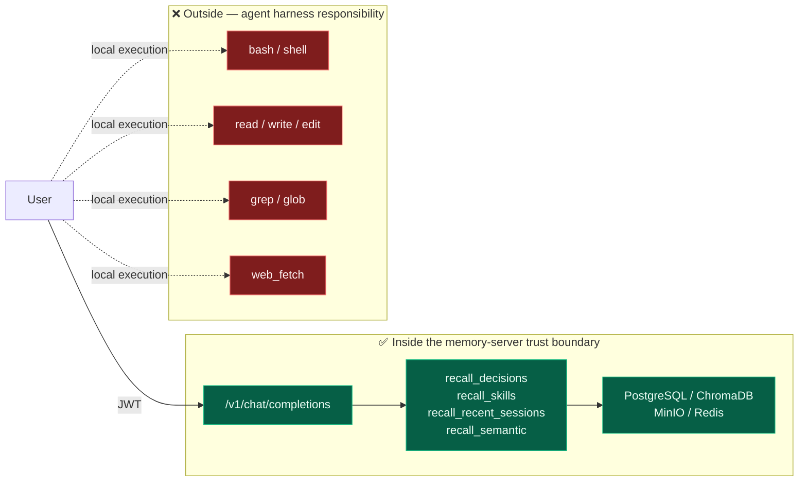

- `bash`, `read`, `edit`, `write`, `grep`, `glob`, `web_fetch`, etc. — executed by the OpenCode / Claude Code / Continue harness on the user's machine, never reaching the memory-server.
- The memory-server sees these only as literal text inside the model's response (rendered as `[tool_call] name(args)` in `interactions.answer`).

This is not a gap to close; it's an honest trust boundary. The memory-server audits what it executes and what it serves. The agent harness is responsible for its own transcript.

---

## Verifying the chain end-to-end (a 60-second operator drill)

```bash
# 1. Fire the probe.
BEARER=$(scripts/audittrace-login --show)
RESPONSE=$(curl -sk -H "Authorization: Bearer $BEARER" \
  -H "X-Project: reconstructibility-demo" \
  -H "Content-Type: application/json" \
  -X POST https://audittrace.local:30952/v1/chat/completions \
  -d '{"model":"qwen3.6-35b-a3b","stream":false,"messages":[{"role":"user","content":"hello"}]}')

# 2. Pull the row (Hop 1).
curl -sk -H "Authorization: Bearer $BEARER" \
  "https://audittrace.local:30952/interactions?project=reconstructibility-demo&limit=1" \
  | jq '.interactions[0] | {id, user_id, session_id, duration_ms, status}'

# 3. Find the Langfuse trace (Hop 3). Copy the trace_id.
curl -s -u "$PK:$SK" \
  "http://192.168.1.231:3000/api/public/traces?userId=$USER_SUB&limit=1&orderBy=timestamp.desc" \
  | jq '.data[0] | {id, name, userId, sessionId}'

# 4. Pull the Tempo spans (Hop 4). Count the tools invoked.
TRACE_ID=<from step 3>
curl -s "http://192.168.1.231:3200/api/traces/$TRACE_ID" \
  | jq '[.batches[].scopeSpans[].spans[] | select(.name | startswith("memory_tool."))] | length'

# 5. Pull the Loki logs (Hop 5).
curl -s --get "http://192.168.1.231:3100/loki/api/v1/query_range" \
  --data-urlencode 'query={namespace="audittrace", pod=~"audittrace-memory-server.+"}' \
  --data-urlencode "start=$(date +%s -d '2 min ago')000000000" \
  --data-urlencode "end=$(date +%s)000000000" \
  | jq '.data.result[0].values[-1]'
```

Four hops, four API calls. Same `user_id` + `session_id` + `trace_id` across all of them.

---

## The operator view — "Sovereign AI Operations" dashboard

When the auditor isn't drilling into a specific request, the Grafana dashboard shows the posture at a glance: latency percentiles, error rate by type, LLM tokens/sec, OTel Collector queue saturation, container logs. If any panel goes red, there's something to investigate — the dashboard is how the day-to-day operator knows the audit trail is intact.

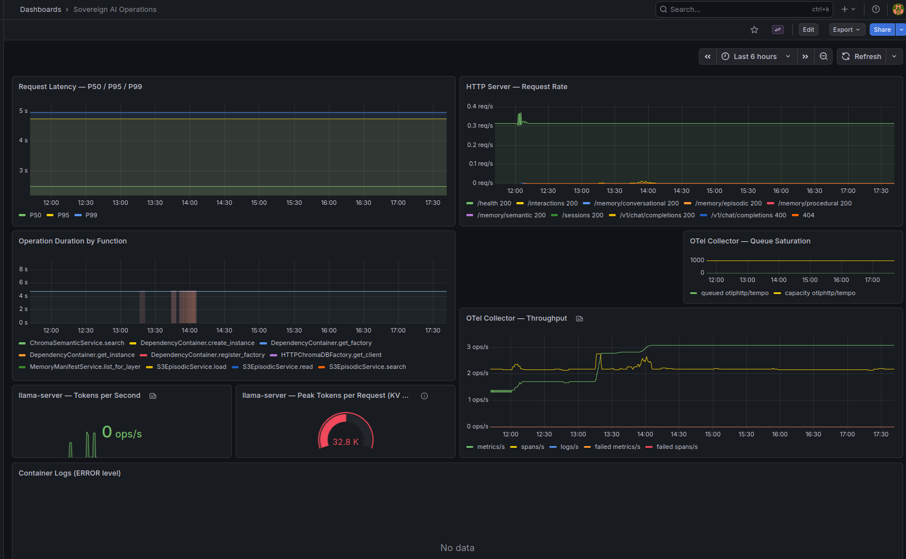

---

## References

- **ADR-024** — proxy pass-through, Langfuse trace decoupling
- **ADR-025** — memory-as-tools, tool-result cache, Decision 8 (cache-hit audit skip)
- **ADR-026** — multi-user identity, RLS posture, scoped wrappers
- **ADR-027** — MinIO object storage, SSE-S3 encryption at rest
- **ADR-028** — observability aggregation stack (Tempo + Prometheus + Loki + Grafana + Langfuse)
- **ADR-029** — end-to-end audit trail, `X-Project` tag, `/interactions` browser
- **ADR-030** — session summariser (Mistral 7B)
- **ADR-032** — OAuth2 Device Flow for human agents
- **ADR-033** — three-audience error envelope, failure-class taxonomy
- **ADR-034** — long-running generation, per-chunk idle timeout, `X-Thinking`
- **ADR-037** — agent tool audit boundary (this doc's "what is NOT" section)
