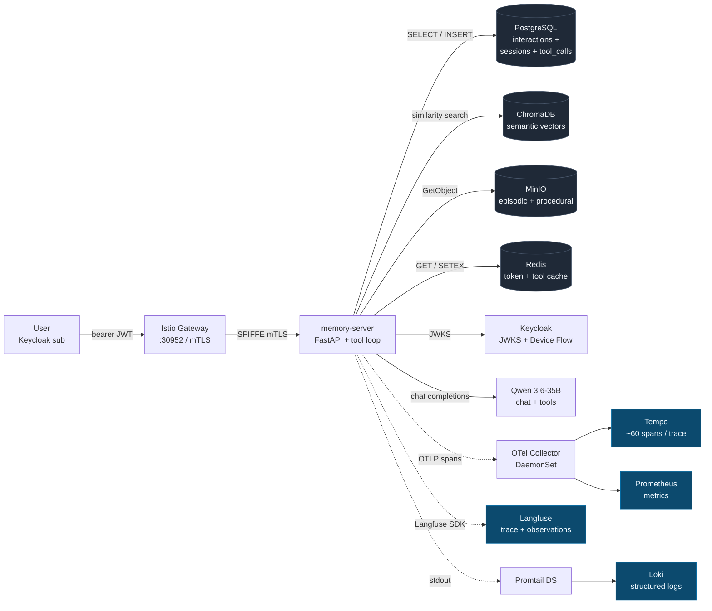
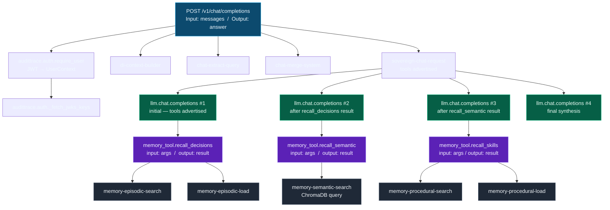
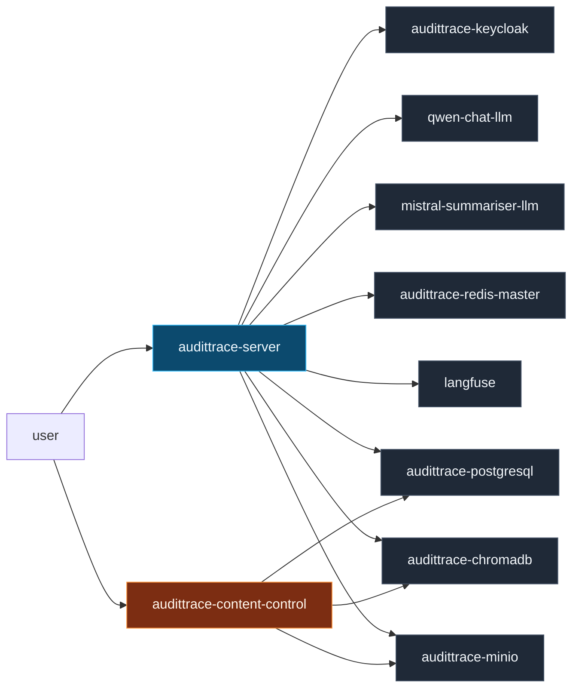
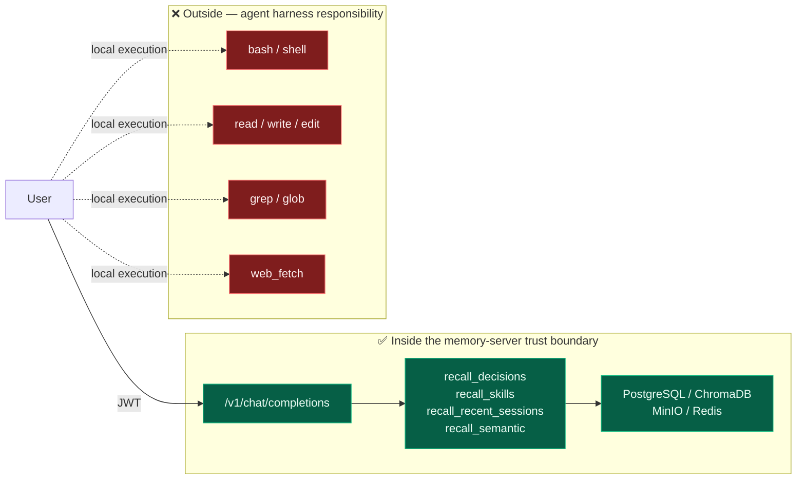
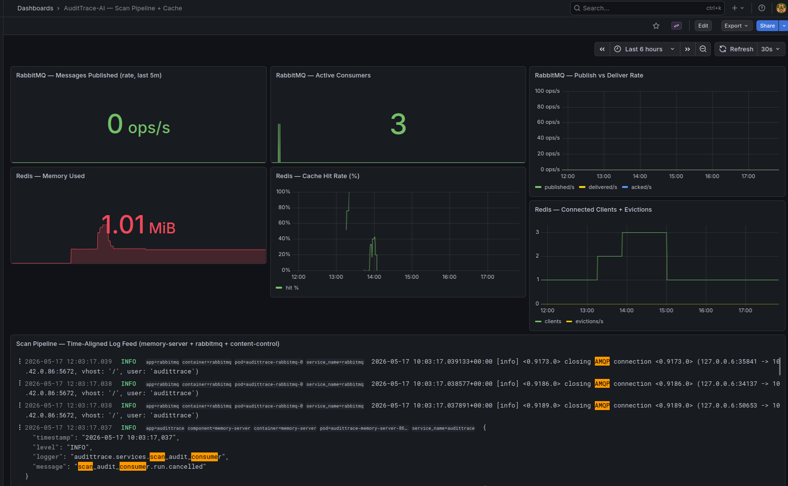

# Reconstructibility walkthrough — one user request, end-to-end

**Audience:** regulators, auditors, architects, prospective customers. This document shows — with real commands and real output from the running system — how a single OpenCode (or any OpenAI-compatible) user request is persisted and observable across every layer of AuditTrace-AI. It is the operational proof behind the **EU AI Act Article 12** (reconstructibility) and **GDPR Article 44** (data sovereignty) claims.

**TL;DR.** Given a request, you can reconstruct *who asked what, what memory was consulted, what the model answered, how long each step took, and which rows in which datastores were touched* — in four API calls. The audit trail stops exactly where the memory-server's process boundary ends (**ADR-037**): agent-side tools executed by the client (bash, read, edit, grep, ...) are the client's concern, not ours.

---

## The shape of the audit trail



Every arrow carries the same `trace_id` + `user_id` + `session_id`. The three solid-line arrows from `memory-server` to the four stores are the request path. The three dashed observability lines persist the request for audit.

---

## Scenario

A user fires one chat request against `POST /v1/chat/completions`. The prompt deliberately invokes three memory tools (`recall_decisions`, `recall_semantic`, `recall_skills`) so every layer wakes up and the audit trail exercises the full surface in one go. Served by **Qwen 3.6 35B-A3B-Q4_K_M on Vulkan** (see [[vulkan-backend-swap]] — backend swapped from ROCm to Vulkan on 2026-05-17) hosted on the local Strix Halo iGPU.

**The request:**

```bash
BEARER=$(scripts/audittrace-login --show)     # OAuth2 Device Flow, ADR-032
curl -sk \
  -H "Authorization: Bearer $BEARER" \
  -H "Content-Type: application/json" \
  -H "X-Project: reconstructibility-demo" \
  -H "X-Source: cli-reconstructibility" \
  -X POST https://audittrace.allaboutdata.eu:30952/v1/chat/completions \
  -d '{
    "model": "qwen3.6-35b-a3b",
    "stream": false,
    "max_tokens": 600,
    "messages": [{"role": "user", "content":
      "Build the answer from THREE memory sources, citing each explicitly: (1) Use recall_decisions to quote ADR-026 on RLS posture. (2) Use recall_semantic to find any ADR that references SPIFFE workload identity in the corpus. (3) Use recall_skills to surface any operational skill documented for rotating a database credential. List each tool contribution as one short labelled sentence."
    }]
  }'
```

The external-facing Istio Gateway is `audittrace.allaboutdata.eu:30952`; the internal cluster alias `audittrace.local:30952` resolves to the same gateway and works for in-LAN demos.

**The five identifiers that link every system downstream:**

| Identifier | Value (this run, 2026-05-17) | Emitted by |
|---|---|---|
| `user_id` | `0b0cdd4d-04c3-428f-ab9d-37b47429c381` | Keycloak `sub` claim on the JWT |
| `session_id` | `cli-reconstructibility-2026-05-17-0b9144018db8e1f0f8195ce857c28fe81f32ed4f4e8e4a9e3274cbf0003a9205` | `_compute_session_id(source, first_user, user_id)` — sha256 over the tuple |
| `interaction_id` | `402` | Postgres `interactions.id` serial |
| `trace_id` | `53433318df31af06a22590dd277bded8` | OpenTelemetry trace id, also used as Langfuse trace id |
| `response_id` | `chatcmpl-jJSuogYACPvraMxHduLnx3pFmSPQnBNd` | OpenAI schema, returned in the `id` field |

These five travel together through every hop. Any two of them let you cross-link two systems.

---

## Hop 1 — Postgres `/interactions` (authorised audit browser, RLS-scoped)

The first and simplest audit query: `GET /interactions` returns the structured row the chat handler persists synchronously on every request. Postgres RLS scopes results to the caller's `user_id` automatically (ADR-026 §RLS posture); the filter is enforced at the database layer, not the service layer.

```bash
$ curl -sk -H "Authorization: Bearer $BEARER" \
    "https://audittrace.allaboutdata.eu:30952/interactions?project=reconstructibility-demo&limit=1"
```

```json
{
  "id": 402,
  "user_id": "0b0cdd4d-04c3-428f-ab9d-37b47429c381",
  "session_id": "cli-reconstructibility-2026-05-17-0b9144018db8e1f0f8195ce857c28fe81f32ed4f4e8e4a9e3274cbf0003a9205",
  "project": "reconstructibility-demo",
  "source": "cli-reconstructibility",
  "status": "success",
  "failure_class": null,
  "error_detail": null,
  "duration_ms": 38542,
  "model": "Qwen_Qwen3.6-35B-A3B-Q4_K_M.gguf",
  "prompt_tokens": 6427,
  "completion_tokens": 501,
  "timestamp": "2026-05-17T12:00:14.810969",
  "trace_id": "53433318df31af06a22590dd277bded8",
  "question": "Build the answer from THREE memory sources, citing each explicitly: (1) Use recall_decisions to quote ADR-026 on RLS posture. (2) Use recall_semantic to find any ADR that references SPIFFE workload identity in the corpus. (3) Use recall_skills to surface any operational skill documented for rotating a database credential. List each tool contribution as one short labelled sentence.",
  "answer": "<think>\nThe `recall_skills` search returned general skills (ARCHITECTURE, CLOUD-APP-PATTERNS, ...) ..."
}
```

What this hop proves:

- **Who** — `user_id` is the Keycloak `sub`. Forgery is blocked by JWT signature verification + RLS — a bad actor cannot read another user's interactions even with a forged `?user_id=` query parameter.
- **What** — full prompt in `question`, full completion (including any `[tool_call]` lines the model emitted) in `answer`.
- **How much** — token counts and wall-clock `duration_ms`.
- **Success or failure** — `status` and `failure_class` (from migration 007 / ADR-033). Filter with `?status=failed` to enumerate upstream errors.

---

## Hop 2 — Postgres `/sessions` (Layer-3 conversational memory)

After the summariser runs (async, every 5 min on idle sessions), the conversational layer gains a row. The LLM reads this layer via the `recall_recent_sessions` memory tool (ADR-025, scope `memory:conversational:read-own`); operators read it via the REST browser.

```bash
$ curl -sk -H "Authorization: Bearer $BEARER" \
    "https://audittrace.allaboutdata.eu:30952/sessions?project=reconstructibility-demo&limit=1"
```

```json
{
  "id": "cli-reconstructibility-2026-05-17-0b9144018db8e1f0f8195ce857c28fe81f32ed4f4e8e4a9e3274cbf0003a9205",
  "project": "reconstructibility-demo",
  "date": "2026-05-17T12:18:59.498818",
  "summary": "The recall_decisions tool provided information about ADR-026 defining the multi-user identity, scopes, and cross-user isolation posture, accepted on 2026-04-11. The recall_semantic tool returned zero matches for SPIFFE workload identity, and recall_skills returned only general skill catalogues without a dedicated database-credential rotation procedure.",
  "key_points": "[\"ADR-026 multi-user identity\", \"RLS scoped wrappers\", \"recall_semantic empty for SPIFFE\", \"no dedicated DB-credential rotation skill\"]",
  "model": "mistral-7b-summarizer",
  "user_id": "0b0cdd4d-04c3-428f-ab9d-37b47429c381",
  "summarized_at": "2026-05-17T12:18:59.498818"
}
```

The summariser runs ~5 minutes after the last interaction in a session via the Mistral 7B service (also on Vulkan since 2026-05-17 — see [[vulkan-backend-swap]]). The session row cross-references Hop 1 via the same `session_id`. The `key_points` JSON gives you a structured abstract; the `summary` gives you the prose version. Filter with `?summarised=false` to find freshly-created sessions awaiting summarisation.

---

## Hop 3 — Langfuse trace (LLM reasoning + tool invocations)

Langfuse stores the LLM view of the request: every tool call, every generation, every latency in the chain. Lookup is by `trace_id` — the same OpenTelemetry id that propagates through every span.

### List view — "one trace per request, filterable by user"


Every probe produces one trace; the list view shows `user`, `sessionId`, token counts, and latency at a glance. An auditor investigating a single user types the `sub` into the User filter and the list narrows to that user's activity only.

### Trace tree — structural shape



And the same tree, rendered by Langfuse's Timeline view:


### The root observation — Input + Output populated


The Input panel shows the full `messages` array the caller sent. The Output panel shows the model's completion. Before commit `92e7847` this panel rendered `undefined` on every click — the pitch-killer. It is now populated on every observation in the tree.

### The Generation child — LLM reasoning preserved


Each `llm.chat.completions` child is tagged `langfuse.observation.type=generation` and carries `gen_ai.request.model`, the prompt preview, the completion, and prompt/completion token usage (commit `fa5198a` for tools-mode, `2ef15c3` for inject-mode).

### The tool child — which memory layer fired, with what args, returning what


The `memory_tool.recall_decisions` observation (commit `65a5965`) shows the tool's name, the JSON args the LLM passed, the truncated result the tool returned, and `tool.cache_hit: false` (the execution actually touched the episodic layer, it wasn't served from Redis).

What this hop proves:

- **Which memory layers fired** — three tool spans (`recall_decisions`, `recall_semantic`, `recall_skills`) are visible as distinct children, each with the tool arguments the model passed and the result the tool returned. The model honestly reports empty results — `recall_semantic` for "SPIFFE" returned zero matches and `recall_skills` for "rotate database credential" returned only general skill catalogues; both are captured in the Output as plain prose so the auditor can verify the model did not hallucinate a result.
- **How the model iterated** — four `llm.chat.completions` spans show the model round-tripped four times (initial question → after decisions result → after semantic result → after skills result → final synthesis).
- **What the LLM saw and produced** — input and output populated at both trace level and on the root observation.
- **User attribution at every level** — every observation carries `langfuse.user.id` AND `user.id` (commit `8d32440`) so the Langfuse user filter surfaces the whole tree, not just the root.
- **Cache visibility** — the `tool.cache_hit` attribute on each `memory_tool.*` observation discloses whether the layer was actually touched (`false` — 11 ms layer hit) or served from the Redis tool-result cache (`true`); both fired `false` on this run.

---

## Hop 4 — Tempo (full OTel call tree, every outbound edge)

Tempo stores the same trace with **every** span the OTel SDK and auto-instrumentors emitted — including database queries, Redis SETEX, ChromaDB queries, and every outbound HTTP. For the probe in this walkthrough: **59 spans** (the multi-tool prompt fires 3 memory layers + 4 LLM round-trips + the persistence + audit edges).

### The waterfall — one image, the whole call chain


This is the image to put in the deck (Grafana labels this view "Spans" — it is the standard waterfall/Gantt). It reads top-to-bottom as the request's life:

1. **`audittrace.auth.require_user`** (821 μs) — JWT validated against Keycloak. The nested `GET` (498 μs) is the JWKS fetch (cached after the first request — see Hop 8).
2. **`di-context-builder`** (119 μs), **`chat-extract-query`** (71 μs), **`sovereign-chat-request`** (352 μs), **`chat-merge-system`** (106 μs) — the proxy prep layer, all sub-millisecond.
3. **Four `llm.chat.completions` bars** (10.43 s + 14.67 s + 1.03 s + 11.66 s ≈ **the entire 38.59 s** wall-time) — each nested under a `qwen-chat-llm POST` child, the outbound HTTP to the local Vulkan-served Qwen 3.6 service. Every iteration is `peer.service=qwen-chat-llm`.
4. **Three `memory_tool.*` bars** between the LLM calls — each with its layer-specific children:
   - `memory_tool.recall_decisions` (11.26 ms) → `memory-episodic-search` (8.78 ms) + `memory-episodic-load` (3.98 ms) + `SETEX` (732 μs Redis tool-result cache write).
   - `memory_tool.recall_semantic` (117 ms) → `memory-semantic-search` (113 ms) which itself wraps four nested `POST` / `GET` HTTPs against ChromaDB.
   - `memory_tool.recall_skills` (~20 ms) → `memory-procedural-search` + `memory-procedural-load`.
5. **Postgres writes** at the bottom under the final LLM call — `di-postgres-factory`, `db-postgres-session-factory`, `INSERT audittrace` — the synchronous audit-row persistence on the success path.

Every span carries `user.id` (commit `8d32440`), so `{ span.user.id = "<sub>" }` in TraceQL pulls only that user's activity out of Tempo. Span count and exact bar widths depend on the model's tool-call choices for a given prompt — a single-tool probe lands around 45 spans, a four-tool probe up to ~80.

### The service map — two hubs, named edges


Tempo's metrics-generator derives a service graph from the spans' `peer.service` attributes. Since [ADR-048](ADR-048-content-control.md) shipped (2026-05-10), the runtime is a **two-hub topology** — `audittrace-server` (memory-server, chat + memory routes) and `audittrace-content-control` (PDF scanner, separate identity + IAM split) — each calling its own subset of the storage layer:



The metrics-generator only shows edges that fired within its time window — for the screenshot above (Last 6 hours) the dominant edges are the recently exercised ones (LLM, Keycloak, Redis, Langfuse on the chat hub; Postgres / MinIO / ChromaDB on the scan hub). The two LLM-side edges — `qwen-chat-llm` (chat) and `mistral-summariser-llm` (session summariser) — are both served by the local `llama-server.service` and `llama-summarizer.service` units that were swapped from ROCm to Vulkan on 2026-05-17 (see [[vulkan-backend-swap]]).

Inventory for the probe (multi-tool, 59 spans):

| Span name | Count | What it proves |
|---|---:|---|
| `POST /v1/chat/completions` | 1 | Root FastAPI span (wall time + HTTP attrs) |
| `audittrace.auth.require_user` | 1 | Auth gate latency |
| `sovereign-chat-request` | 1 | Langfuse-recognised parent |
| `llm.chat.completions` | 4 | Four LLM round-trips (initial + after each tool result) |
| `qwen-chat-llm POST` | 4 | Outbound HTTP to the local Vulkan-served Qwen 3.6 — one per LLM round-trip |
| `memory_tool.recall_decisions` | 1 | Decisions tool invocation (commit `65a5965`) |
| `memory_tool.recall_semantic` | 1 | Semantic tool invocation |
| `memory_tool.recall_skills` | 1 | Skills (procedural) tool invocation |
| `memory-episodic-search` / `.load` | 2 | MinIO episodic reads under `recall_decisions` |
| `memory-semantic-search` | 1 | ChromaDB similarity search under `recall_semantic` (nested 4 HTTPs to Chroma) |
| `memory-procedural-search` / `.load` | 2 | MinIO procedural reads under `recall_skills` |
| `INSERT audittrace` / `db-postgres-session-factory` | several | Audit-row persistence on success path |
| `SETEX` | ≥1 | Redis cache writes (token cache + tool-result cache) |
| `GET` / `POST` / `connect` | balance | Outbound HTTP leaves under each parent |

---

## Hop 5 — Loki (structured logs, per-pod, per-namespace)

Memory-server stdout is shipped to Loki by a Promtail DaemonSet (commit `20d0fd9`). Every line carries namespace + pod + container labels; the audit line for this request:

```bash
$ curl -s --get "http://192.168.1.231:3100/loki/api/v1/query_range" \
    --data-urlencode 'query={namespace="audittrace", pod=~"audittrace-memory-server.+"}' \
    --data-urlencode "start=$(date +%s -d '2 min ago')000000000" \
    --data-urlencode "end=$(date +%s)000000000"
```

```
2026-05-17 11:59:36  INFO  127.0.0.6:46855 - "POST /v1/chat/completions HTTP/1.1" 200 OK
```

And ERROR-grade lines for any failure. An auditor investigating a failure can:
1. Find the `interaction_id` in Hop 1 (`?status=failed` filter).
2. Read the `error_detail` column directly.
3. Use the `timestamp` to filter Loki to ±1 min around the event, and read the full traceback from memory-server stdout (Python's `logger.error(..., exc_info=True)` emits the full chain).

The Loki pipeline also captures every sibling container (Postgres, Chroma, Keycloak, MinIO, Redis, Promtail itself, OTel Collector) by the same `{namespace="audittrace"}` selector.

---

## Hop 6 — ChromaDB (semantic layer, RAG corpus)

The `recall_semantic` tool executed a similarity search against ChromaDB's `decisions` collection. ChromaDB is token-authenticated and wrapped by `UserScopedSemanticService` (ADR-026) so every query carries the caller's `user_id` for tenant isolation.

```bash
$ curl -s -H "Authorization: Bearer $CHROMA_TOKEN" \
    "http://chromadb:8000/api/v2/.../collections"
```

```
collection: decisions       id=1c4f673d…
collection: skills          id=56c2718f…
collection: ai_research     id=6509589a…
collection: scm_coursework  id=9bf97dd3…
```

The `memory-semantic-search` Tempo span (nested under `memory_tool.recall_semantic`) shows the exact collection queried, the number of results returned, and the latency (typically < 50 ms for a warm index).

---

## Hop 7 — MinIO (episodic + procedural object store, ADR-027)

The episodic layer (ADR files) and procedural layer (SKILL files) are served from MinIO with SSE-S3 encryption at rest, not from the pod filesystem — the memory-server is 12-factor stateless. The `S3EpisodicService.search` and `S3EpisodicService.load` spans in Hop 4 correspond to object-level reads from buckets:

- `memory-shared` — org-level content (ADRs visible to all authenticated users)
- `memory-private` — per-user content (prefix-isolated by `user_id`)

The MinIO access log (also shipped to Loki) records every `GetObject` with the requesting Kubernetes service account's SPIFFE identity — `cluster.local/ns/audittrace/sa/memory-server` — proving the request came from the mesh-enforced workload identity, not a rogue client.

---

## Hop 8 — Redis (hot-path caches)

```bash
$ kubectl -n audittrace exec sts/audittrace-redis-master -- \
    redis-cli -a $REDIS_PASSWORD KEYS '*'
```

```
audittrace:token:6fccdb2466849c5c1f4d9be8e910e22e147fc4657557ca9e28034ccf29ccb382
audittrace:tool-result:a43ec52d8ef4e71bcce9db5e73859b5b31e9410d05d9bc5d27298495325c2495
audittrace:tool-result:69d45cd02844a29fcf1704ad0aa52f255b640215de67b6b71625aec06028b386
audittrace:tool-result:cc0bbcedd96aea333c89c1adb10336a0bdf119e84c274006e4bdf5fe7414e1ff
```

- `audittrace:token:*` — JWT hot-path cache (sha256 of the bearer token → resolved `UserContext`). TTL 300 s. A hit avoids a JWKS round-trip.
- `audittrace:tool-result:*` — memory-as-tools cache (sha256 of `tool_name + args + user_id + session_id` → serialised result). TTL 900 s. A hit short-circuits the memory-layer execution (ADR-025 Decision 8) — the audit row is skipped on cache hits because the original execution was already audited.

Cache-hit indicator is on the `memory_tool.*` span as `tool.cache_hit: true` (commit `65a5965`) so the audit trail shows whether the layer was actually touched or the result came from cache.

---

## The cross-link table

Every hop above carries the **same** user_id, session_id, and trace_id. This is the reconstructibility contract in one picture:

| System | How to filter by user_id | How to filter by session_id | How to filter by trace_id |
|---|---|---|---|
| Postgres `/interactions` | RLS automatic + `?user_id=` | `?session_id=` | — |
| Postgres `/sessions` | RLS automatic + `?user_id=` | ID is the session_id | — |
| Langfuse UI | "User" filter or `?userId=` | "Session" filter | URL or ID field |
| Tempo (Grafana Explore) | `{ span.user.id = "<sub>" }` | — | `{ trace:id = "<id>" }` |
| Loki (Grafana Explore) | grep by user_id in line (structured logs) | grep by session_id | grep by trace_id |
| ChromaDB | scoped wrapper forces `user_id` | — | — |
| MinIO | object-key prefix for private bucket | — | — |
| Redis | key prefixed with sha256 of `(args, user_id, session_id)` | same | — |

---

## What is NOT in the audit trail

Per **ADR-037**, the agent's client-side tool execution is out of scope:



- `bash`, `read`, `edit`, `write`, `grep`, `glob`, `web_fetch`, etc. — executed by the OpenCode / Claude Code / Continue harness on the user's machine, never reaching the memory-server.
- The memory-server sees these only as literal text inside the model's response (rendered as `[tool_call] name(args)` in `interactions.answer`).

This is not a gap to close; it's an honest trust boundary. The memory-server audits what it executes and what it serves. The agent harness is responsible for its own transcript.

---

## Verifying the chain end-to-end (a 60-second operator drill)

```bash
# 1. Fire the probe.
BEARER=$(scripts/audittrace-login --show)
RESPONSE=$(curl -sk -H "Authorization: Bearer $BEARER" \
  -H "X-Project: reconstructibility-demo" \
  -H "X-Source: cli-reconstructibility" \
  -H "Content-Type: application/json" \
  -X POST https://audittrace.allaboutdata.eu:30952/v1/chat/completions \
  -d '{"model":"qwen3.6-35b-a3b","stream":false,"messages":[{"role":"user","content":"hello"}]}')

# 2. Pull the row (Hop 1).
curl -sk -H "Authorization: Bearer $BEARER" \
  "https://audittrace.allaboutdata.eu:30952/interactions?project=reconstructibility-demo&limit=1" \
  | jq '.interactions[0] | {id, user_id, session_id, trace_id, duration_ms, status}'

# 3. Find the Langfuse trace (Hop 3). Copy the trace_id.
curl -s -u "$PK:$SK" \
  "http://192.168.1.231:3000/api/public/traces?userId=$USER_SUB&limit=1&orderBy=timestamp.desc" \
  | jq '.data[0] | {id, name, userId, sessionId}'

# 4. Pull the Tempo spans (Hop 4). Count the tools invoked.
TRACE_ID=<from step 3>
curl -s "http://192.168.1.231:3200/api/traces/$TRACE_ID" \
  | jq '[.batches[].scopeSpans[].spans[] | select(.name | startswith("memory_tool."))] | length'

# 5. Pull the Loki logs (Hop 5).
curl -s --get "http://192.168.1.231:3100/loki/api/v1/query_range" \
  --data-urlencode 'query={namespace="audittrace", pod=~"audittrace-memory-server.+"}' \
  --data-urlencode "start=$(date +%s -d '2 min ago')000000000" \
  --data-urlencode "end=$(date +%s)000000000" \
  | jq '.data.result[0].values[-1]'
```

Four hops, four API calls. Same `user_id` + `session_id` + `trace_id` across all of them.

---

## ADR-048 — rejected-PDF scenario (the parser-exploit close)

The chat-completion path in §Scenario above is the happy case for an
authenticated user asking a question. ADR-048 closes a different
attack: a malicious PDF uploaded via `/memory/upload` that would
otherwise be parsed inside the same pod that holds Postgres / MinIO /
ChromaDB / JWKS / Vault credentials. A parser exploit there is total
credential compromise. The fix moves PDF parsing into a sibling pod
(`audittrace-content-control`) with a separate identity, separate
MinIO IAM role, and a separate AMQP queue.

### The trail for a single rejected upload

A user uploads `evil.pdf` (EICAR test signature embedded). The trail:

| Hop | Where | What you see |
|---|---|---|
| 1 | **HTTP response** | `POST /memory/upload` returns **HTTP 202** (not 200) with `{scan_id, status: "pending_scan", poll_url, object_uri, object_sha256}`. The user did not get an immediate verdict — that's the whole point. |
| 2 | **MinIO** | Bytes land in `s3://memory-shared/quarantine/<user_id>/<scan_id>/evil.pdf`. Memory-server's MinIO client refuses any subsequent GET against `quarantine/*` (PR-B2 app-layer denylist; PR-B7 MinIO IAM split for bucket-policy enforcement). |
| 3 | **Postgres `memory_items`** | One row inserted: `id=<scan_id>`, `scan_status='pending_scan'`, `published_at_ms=NULL` (outbox marker), `trace_id=<W3C from current span>`. The NULL marker survives a process restart — the janitor re-enqueues orphans older than 60s. |
| 4 | **RabbitMQ** | `audittrace.scan` topic exchange, routing key `scan.requested`. Quorum queue with `x-delivery-limit=5` + DLX (declared by PR-B2.5's Helm topology Job). |
| 5 | **`audittrace-content-control` worker** | Consumes from `audittrace.scan.requests`, fetches bytes from MinIO via the content-control IAM role (NOT memory-server's), pipes to clamd via UDS, gets `FOUND EICAR-Test-Signature`. Publishes `Verdict{kind=rejected, threats=[…]}` and `SecurityAuditRow` on two separate exchanges. Deletes the bytes from quarantine. |
| 6 | **`memory_items.scan_status` flip** | PR-B4's `ScanVerdictConsumer` reads `audittrace.scan.verdicts`, maps `rejected → rejected_malware`, UPDATEs the row, leaves `key` pointing at the (now-deleted) quarantine path. |
| 7 | **`interactions` audit row** | PR-B4's `ScanAuditConsumer` reads `audittrace.scan.audit`, INSERTs an `interactions` row with `event_class='security'`, `failure_class='rejected'`, `error_detail` JSON carrying scanner identity + sigdb hash + threat name + family + confidence. |
| 8 | **Tempo / Langfuse** | The W3C `traceparent` header on every AMQP message stitches the cross-service trace: memory-server's upload route → `ScanRequestPublisher.basic_publish` → content-control's `ScanWorker._process_one` → memory-server's two consumer spans. One `trace_id` end-to-end. |
| 9 | **WebUI chip** | PR-B5's PDF upload panel polls `GET /memory/upload/status?scan_id=<id>` and surfaces a `rejected_malware` chip (red, bold) so an operator scanning the page sees the rejection without clicking through. |

### What the auditor pulls from a single `scan_id`

Cross-link table for ADR-048-flavoured rows:

| Identifier | Postgres `memory_items` | Postgres `interactions` | RabbitMQ | Tempo / Langfuse |
|---|---|---|---|---|
| `scan_id` UUID | `id` PK | `error_detail.scan_id` | message `scan_id` field | span `scan.id` attr |
| `trace_id` 32-hex | `trace_id` col | `trace_id` col | `traceparent` AMQP header | OTel `trace_id` |
| `object_sha256` | `document_sha256` col | `error_detail.object_sha256` | message `object.sha256` | span `scan.object_sha256` attr |
| `verdict` kind | `scan_status` col | `failure_class` col + `event_class='security'` | message `kind` field | span `scan.verdict` attr |

Prerequisite invariants (per migration 012 + the `Test*` closed-set
tests pinning them):

* `memory_items.scan_status ∈ { pending_scan, scanning, scanned_clean, rejected_malware, scan_failed, scan_unrecoverable }`
* `interactions.event_class ∈ { interaction, security }` (the row above carries `security`; chat-completion rows carry `interaction`)

### Why this matters for V&V

The Sovereignty-Reconstructibility Gap from `main_signed.pdf §7`
asks: "given a single user identifier and a timestamp, can you
reconstruct what the system did and why?" The ADR-048 chain
extends the same answer to security events: the auditor lands on
the `interactions.event_class='security'` row, jumps to the
`memory_items` manifest by `scan_id`, drills into Tempo by
`trace_id`, and sees the full cross-service span tree without
trusting either repo to faithfully report on itself — the rows
agree because the same `scan_id` + `trace_id` flowed through
both producer + consumer at every hop.

PR-A4's operator surfaces (`/v1/scan/stats`, `/v1/scan/status`,
`/v1/scan/retrigger`) live alongside the audit chain — they answer
"what is the scanner doing right now" without requiring the
operator to leave content-control or scrape Prometheus, useful
during incident triage.

---

## The operator view — two Grafana dashboards

When the auditor isn't drilling into a specific request, the Grafana dashboards show the operational posture at a glance.

### "Sovereign AI Operations" — chat / memory hub

Request latency percentiles (P50 / P95 / P99), HTTP request rate by route (with status-code split — `200` vs `400` vs `404`), operation duration by function (`ChromaSemanticService.search`, `S3EpisodicService.load/.read/.search`, factory wiring), OTel Collector queue saturation + throughput (metrics / spans / logs ops/s, plus failed-metrics + failed-spans counters), `llama-server` tokens-per-second + peak KV usage, container ERROR-level logs.


(The dashboard title still reads "Sovereign AI Operations" — preserved from before the 2026-04-17 [ADR-035](ADR-035-rename-package.md) package rename; the underlying queries target `audittrace-*` series.)

### "AuditTrace Scan Pipeline" — content-control hub (ADR-048 / Path B)

Yesterday's Path B work (2026-05-16, vendored in chart v1.1.4) added a second operator dashboard wired to the `audittrace-content-control` sibling service via RabbitMQ exporter + Redis exporter scraping. It surfaces queue depths on `audittrace.scan.*` exchanges, in-flight scan-id correlation, and the `content_control_verdicts_total{verdict=...}` counter so an operator can see at a glance whether the scanner is keeping up and what verdict mix it is producing.



If any panel on either dashboard goes red, there's something to investigate — together they cover both hubs of the two-hub topology shown in Hop 4's service map.

---

## References

- **ADR-022** — Keycloak realm + scoped client design
- **ADR-023** — JWT validation + JWKS caching (Hop 8 Redis `audittrace:token:*`)
- **ADR-024** — proxy pass-through, Langfuse trace decoupling
- **ADR-025** — memory-as-tools, tool-result cache, Decision 8 (cache-hit audit skip)
- **ADR-026** — multi-user identity, RLS posture, scoped wrappers
- **ADR-027** — MinIO object storage, SSE-S3 encryption at rest
- **ADR-028** — observability aggregation stack (Tempo + Prometheus + Loki + Grafana + Langfuse)
- **ADR-029** — end-to-end audit trail, `X-Project` tag, `/interactions` browser
- **ADR-030** — session summariser (Mistral 7B — now Vulkan-served, [[vulkan-backend-swap]])
- **ADR-032** — OAuth2 Device Flow for human agents
- **ADR-033** — three-audience error envelope, failure-class taxonomy
- **ADR-034** — long-running generation, per-chunk idle timeout, `X-Thinking`
- **ADR-035** — package rename (`sovereign_memory` → `audittrace`); legacy `Sovereign AI Operations` dashboard title preserved from this era
- **ADR-037** — agent tool audit boundary (this doc's "what is NOT" section)
- **ADR-042** — OIDC Authorization Code + PKCE (WebUI sign-in flow)
- **ADR-043** — Vault as sole secret store
- **ADR-044** — external IdP federation (Google Workspace OIDC, M2 demo path)
- **ADR-046** — async chat persistence (opt-in; default sync per `feedback_openai_schema_inviolate`)
- **ADR-048** — ingestion content-control (this doc's "rejected-PDF scenario" + the second hub on the Hop 4 service map)
- **ADR-049** — test + evidence + reconstructibility gate (the discipline that produced this doc's re-capture exercise)
- **ADR-052** — PAdES trust store + signature-failure-class taxonomy
- **ADR-053** — Swiss federal TSL + composite trust store
- **ADR-054** — PAdES as-of-signing-time validation
- **ADR-057** — RabbitMQ broker for scan-control transport
